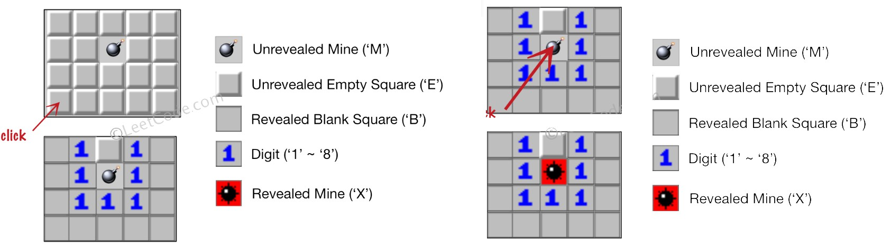

[h2pl/leetcode](https://github.com/h2pl/leetcode)的C++实现，附带一些扩充。用于秋招第一遍分tag刷题，查漏补缺，并建立手撸算法的基本手感。


- [算法思想](#算法思想)
  - [排序](#排序算法)
    - [七大基于比较的排序算法](#七大基于比较的排序算法)
    - [利用排序思想的算法](#利用排序思想的算法)
  - [二分查找](#二分查找)
  - [贪心思想](#贪心思想)
  - [双指针思想](#双指针思想)
  - [搜索](#搜索)
    - [广度优先搜索BFS](#广度优先搜索BFS)
    - [深度优先搜索DFS](#深度优先搜索DFS)
    - [回溯法backtracking](#回溯法backtracking)
  - [分治策略](#分治策略)
  - [动态规划](#动态规划)
    - [分割整数](#分割整数)
    - [矩阵路径](#矩阵路径)
    - [斐波那契数列](#斐波那契数列)
    - [子序列问题](#子序列问题)
    - [子区间问题](#子区间问题)
    - [0-1背包问题](#0-1背包问题)
- [数据结构](#数据结构)
  - [二叉树](#二叉树)
    - [二叉树的遍历](#二叉树的遍历)

<br>

# 算法思想

## 排序

### 七大基于比较的排序算法

#### 冒泡排序

```c++
// O(n^2)，稳定，从后往前遍历时发现逆序即立刻交换
void bubbleSort(vector<int> &ivec){
    int len = ivec.size();
    for(int i = 0; i < len; ++i)
        for(int j = 0; j < len - i - 1; ++j)
            if(ivec[j] > ivec[j + 1])	
                swap(ivec[j], ivec[j + 1]);
}
```

<br>

#### 选择排序

```c++
// O(n^2)，不稳定，第i次遍历时，选择下标[i, n)中数值最小的数放在i处
void selectionSort(vector<int> &ivec){
    int len = ivec.size();
    for(int i = 0; i < len; ++i){
        int minIdx = i;
        for(int j = i + 1; j < len; ++j)
            if(ivec[j] < ivec[i])	
                minIdx = j;
        swap(ivec[i], ivec[minIdx]);
    }
}
```

<br>

#### 插入排序

```c++
// O(n^2)，稳定，遍历第i个数时，一直将它往前交换直到不再比前一个数更大
void insertionSort(vector<int> &ivec){
    for(int i = 1; i < ivec.size(); ++i){
	int j = i - 1;
	while(j >= 0 && ivec[j + 1] < ivec[j])
	    swap(ivec[j + 1], ivec[j]),	--j;
    }
}
```

<br>

#### 归并排序

```c++
// O(nlogn)，稳定，不断分成更小的数组进行归并
void merge(vector<int> &ivec, int low, int mid, int high){
    vector<int> helper;
    int L = low, R = mid + 1;
    while(L <= mid && R <= high)
        ivec[L] < ivec[R] ? helper.push_back(ivec[L++]) : helper.push_back(ivec[R++]);
    while(L <= mid)
        helper.push_back(ivec[L++]);
    while(R <= high)
        helper.push_back(ivec[R++]);
    for(int i = low; i <= high; ++i)
        ivec[i] = helper[i - low];
}
void mergeSort(vector<int> &ivec, int low, int high){
    if(low >= high)
        return;
    int mid = (high - low) / 2 + low;
    mergeSort(ivec, low, mid);
    mergeSort(ivec, mid + 1, high);
    merge(ivec, low, mid, high);
}
// 排序入口
void mergeSort(vector<int> &ivec){
    mergeSort(ivec, 0, ivec.size() - 1);
}
```

<br>

#### 快速排序

```c++
//O(nlogn)，不稳定，找到第i个数，使[0,i)中均比它小且(i,n)中均比它大，再对[0,i)和(i,n)进行快排
void quickSort(vector<int> &ivec, int low, int high){
    if(low >= high)
	return;
    // 找到pivot_value满足上述条件
    int pivot_value = ivec[low];
    int pivot = low;
    for(int i = low + 1; i <= high; ++i)
	if(ivec[i] < pivot_value){
            ++pivot;
            swap(ivec[i], ivec[pivot]);
	}
    swap(ivec[low], ivec[pivot]);
    // 对[i,pivot),(pivot, n)继续快排
    quickSort(ivec, low, pivot - 1);
    quickSort(ivec, pivot + 1, high);
}
// 排序入口
void quickSort(vector<int> &ivec){
    quickSort(ivec, 0, ivec.size() - 1);
}
```

<br>

#### 堆排序

```c++
// 自己网上找资料看吧
void heapDown(vector<int> &ivec, int beg, int end){	// 调整 ivec[beg...end] 使之满足大顶堆要求
    for(int cur = beg, child = beg * 2 + 1; child <= end; cur = child, child = child * 2 + 1){
        if(child < end && ivec[child] < ivec[child + 1])
            ++child;
        if(ivec[cur] > ivec[child])	// 调整父节点和子节点的关系
            break;
        else
            swap(ivec[cur], ivec[child]);
    }
}
// 排序入口
void heapSort(vector<int> &ivec){
    // 构造大顶堆
    for(int i = ivec.size() / 2 - 1; i >= 0; --i)
        heapDown(ivec, i, ivec.size() - 1);
    // 交换堆顶元素，并再次调整为大顶堆
    for(int i = ivec.size() - 1; i > 0; --i){
        swap(ivec[0], ivec[i]);
        heapDown(ivec, 0, i - 1);
    }
}
```

<br>

### 利用排序思想的算法

[leetcode.215 数组中的第K个最大元素 medium](https://leetcode-cn.com/problems/kth-largest-element-in-an-array/)（或前K个最大的元素）

> 在未排序的数组中找到第 **k** 个最大的元素。请注意，你需要找的是数组排序后的第 k 个最大的元素，而不是第 k 个不同的元素。
>
> **示例:**
>
> ```
> 输入: [3,2,1,5,6,4] 和 k = 2
> 输出: 5
> 
> 输入: [3,2,3,1,2,4,5,5,6] 和 k = 4
> 输出: 4
> ```

```c++
// 思路1：利用堆排序，第K次弹出大顶堆的堆顶即为第K大的元素。其中heapDown函数见堆排序
int findKthLargest(vector<int>& nums, int k) {
    // 构造大顶堆
    for(int i = nums.size() / 2 - 1; i >= 0; --i)
        heapDown(nums, i, nums.size() - 1);
    // 前k-1次换到数组末尾后，堆顶nums[0]即为第k大
    int cnt = 0;
    while(++cnt < k){	// 注意：条件 (++cnt < k) 进行 k-1 次操作， (cnt++ < k) 进行 k 次操作
        swap(nums[0], nums[nums.size() - cnt]);
        heapDown(nums, 0, nums.size() - cnt - 1);
    }
    return nums[0]; 	// k-1次操作之后的堆顶即为第k大的元素
}

// 思路2：利用快速排序，找到第k-1个枢点，此时0~k-1是最小的k个值
//			 枢点pivot<k => 搜索[pivot+1, high]。 枢点pivot>k => 搜索[left, pivot-1]
// 			 此方法的渐进时间复杂度理论上是log(n)
```

<br>[剑指offer 数组中的逆序对](https://www.nowcoder.com/practice/96bd6684e04a44eb80e6a68efc0ec6c5?tpId=13&tqId=11188&tPage=1&rp=1&ru=/ta/coding-interviews&qru=/ta/coding-interviews/question-ranking)

> 在数组中的两个数字，如果前面一个数字大于后面的数字，则这两个数字组成一个逆序对。输入一个数组,求出这个数组中的逆序对的总数P。并将P对1000000007取模的结果输出。 即输出P%1000000007
>
> 题目保证输入的数组中没有的相同的数字, 数据范围：对于%50的数据,size<=10^4, 对于%75的数据,size<=10^5, 对于%100的数据,size<=2*10^5
>
> **示例：**
>
> ```
> 输入：1,2,3,4,5,6,7,0
> 输出：7
> ```

```c++
// 思路：在归并排序的过程中对逆序对进行统计
int InversePairs(vector<int> nums) {
    int cnt = 0;
    mergeCount(nums, 0, nums.size() - 1, cnt);
    return cnt;
}

void mergeCount(vector<int> &nums, int left, int right, int &cnt){
    if(left >= right)
        return;
    int mid = (right - left) / 2 + left;
    mergeCount(nums, left, mid, cnt);
    mergeCount(nums, mid + 1, right, cnt);
    merge(nums, left, mid, right, cnt);
}
void merge(vector<int> &nums, int left, int mid, int right, int &cnt){
    vector<int> tmp;
    int l = left, r = mid + 1;
    while(l <= mid && r <= right)
        if(nums[l] <= nums[r])
            tmp.push_back(nums[l++]);
    else{
        cnt = (cnt + mid - l + 1) % 1000000007;
        tmp.push_back(nums[r++]);
    }
    while(l <= mid)
        tmp.push_back(nums[l++]);
    while(r <= right)
        tmp.push_back(nums[r++]);
    for(int i = left; i <= right; ++i)
        nums[i] = tmp[i - left];
}
```

<br>

[leetcode. 280 摆动排序 medium](https://leetcode-cn.com/problems/wiggle-sort/)

> 给定一个无序的数组 `nums`，将它重新排列成 `nums[0] <= nums[1] >= nums[2] <= nums[3]...` 的顺序。
>
> 示例：
>
> ```
> 输入： [3, 5, 2, 1, 6, 4]
> 输出：一个可能的答案是[1, 6, 2, 5, 3, 4]
> ```

```c++
// 思路1: 先进行排序，然后交换1-2, 3-4, 5-6  ==> O(nlogn)
void wiggleSort(vector<int> &nums) {
    sort(nums.begin(), nums.end());
    if(nums.size() <= 2)
        return;
    for(int i = 2; i < nums.size(); i += 2)
        swap(nums[i], nums[i - 1]);
}

// 思路：由题意的，下标为奇数的大于等于两侧，下标为偶数的小于等于两侧，不满足的话将该数与左侧交换即可 O(n)
void wiggleSort(vector<int> &nums){
    if(nums.size() <= 1)
        return;
    for(int i = 1; i < nums.size(); ++i)
        if((i % 2 == 1 && nums[i] < nums[i - 1]) 
            || (i % 2 == 0 && nums[i] > nums[i - 1]))
            swap(nums[i], nums[i - 1]);
}
```

<br>

[leetcode.324 摆动序列II medium](https://leetcode-cn.com/problems/wiggle-sort-ii/)

> 给定一个无序的数组 nums，将它重新排列成 nums[0] < nums[1] > nums[2] < nums[3]... 的顺序。
>
> 示例 :
>
> ```
> 输入: nums = [1, 5, 1, 1, 6, 4]
> 输出: 一个可能的答案是 [1, 4, 1, 5, 1, 6]
> 
> 输入: nums = [1, 3, 2, 2, 3, 1]
> 输出: 一个可能的答案是 [2, 3, 1, 3, 1, 2]
> ```
>
> 说明:
> 你可以假设所有输入都会得到有效的结果。
>
> 进阶:
> 你能用 O(n) 时间复杂度和 / 或原地 O(1) 额外空间来实现吗？

```c++
// 思路：先进行排序，不能交换相互挨着的两个数，可能相等
// 		将排序后的数组分为前后两半，分别从前半部分和后半部分取出最后一个数，可以保证不等
void wiggleSort(vector<int>& nums) {
    vector<int> temp = nums;
    sort(temp.begin(), temp.end());

    // left_back取中间，right_back取末尾
    int left_back = (nums.size() % 2 == 1) ? nums.size() / 2 : nums.size() / 2 - 1;
    int right_back = nums.size() - 1;

    for(int i = 0; i < nums.size(); ++i)
        nums[i] = (i % 2 == 0) ? temp[left_back--] : temp[right_back--];
}
```

<br>

## 二分查找

[leecode.69 x的平方根 easy](https://leetcode-cn.com/problems/sqrtx/)

> 描述：实现 int sqrt(int x) 函数。计算并返回 x 的平方根，其中 x 是非负整数。由于返回类型是整数，结果只保留整数的部分，小数部分将被舍去。
>
> **示例 :**
>
> ```
> 输入: 4
> 输出: 2
> 
> 输入: 8
> 输出: 2
> 说明: 8 的平方根是 2.82842..., 
> 由于返回类型是整数，小数部分将被舍去。
> ```

```C++
int mySqrt(int x) {
    if(x <= 1)
        return x;
    int low = 1, high = x;
    while(low <= high){
        int mid = (high - low) / 2 + low;
        if(x / mid == mid)
            return mid;
        else if(x / mid < mid)
            high = mid - 1;
        else
            low = mid + 1;
    }
    return high;
}
```

<br>[leetcode.367 有效的完全平方数 easy](https://leetcode-cn.com/problems/valid-perfect-square/)

> 给定一个正整数 num，编写一个函数，如果 num 是一个完全平方数，则返回 True，否则返回 False。
>
> 说明：不要使用任何内置的库函数，如  sqrt。
>
> **示例 ：**
>
> ```
> 输入：16
> 输出：True
> 
> 输入：14
> 输出：False
> ```

```C++
bool isPerfectSquare(int num) {
    if(num < 1)
        return false;
    int low = 1, high = num;
    while(low <= high){
        int mid = (high - low) / 2 + low;
        if(num / mid == mid && num % mid == 0)
            return true;
        else if(num / mid < mid)
            high = mid - 1;
        else
            low = mid + 1;
    }
    return false;
}
```

<br>[leetcode.441 排列硬币 easy](https://leetcode-cn.com/problems/arranging-coins/)

> 你总共有 n 枚硬币，你需要将它们摆成一个阶梯形状，第 k 行就必须正好有 k 枚硬币。给定一个数字 n，找出可形成完整阶梯行的总行数。n 是一个非负整数，并且在32位有符号整型的范围内。
>
> **示例 :**
>
> ```
> n = 5
> 硬币可排列成以下几行:
> ¤
> ¤ ¤
> ¤ ¤
> 因为第三行不完整，所以返回2.
> ```

```C++
int arrangeCoins(int n) {
    if(n < 1)
        return 0;
    int low = 1, high = n;
    while(low <= high){
        int mid = (high - low) / 2 + low;
        long long total = (mid + 1) * (long long)mid / 2;
        if(total == n)
            return mid;
        else if(total < n)
            low = mid + 1;
        else
            high = mid - 1;
    }
    return high;
}
```

<br>[leetcode.50 Pow(x,n) medium](https://leetcode-cn.com/problems/powx-n/)

> 实现 [pow(*x*, *n*)](https://www.cplusplus.com/reference/valarray/pow/) ，即计算 x 的 n 次幂函数。
>
> **示例:**
>
> ```
> 输入: 2.00000, 10
> 输出: 1024.00000
> 
> 输入: 2.00000, -2
> 输出: 0.25000
> 解释: 2-2 = 1/22 = 1/4 = 0.25
> ```

```C++
// 思路：对x依次做1,2,4,...次幂，得到x, x*x, x*x*x*x，直到指数次数为不大于n的最大值
// 保存x*x*x*x...，并从n中减去该指数次数
// 重复操作，将所有x*x...连续乘起来即为所求
double myPow(double x, int n) {
    bool sign = n < 0;
    long long exp = abs((long long)n);  // 先转化为longlong再abs，防止出现n=INT_MIN
    double res = 1.0;
    while(exp > 0){
        long long e = 1;// 指数  1 -> 2   -> 4 ...
        double mul = x; // 结果  x -> x*x -> x*x*x*x ...
        while((e*2) < exp){   // 直到e*2仍小于exp
            e = e << 1;
            mul = mul * mul;
        }
        exp -= e;
        res *= mul;
    }
    return sign ? 1.0/res : res;
}
```

<br>[剑指offer 数字在排序数组中出现的次数](https://www.nowcoder.com/practice/70610bf967994b22bb1c26f9ae901fa2?tpId=13&tqId=11190&tPage=2&rp=2&ru=/ta/coding-interviews&qru=/ta/coding-interviews/question-ranking)

> 统计一个数字在排序数组中出现的次数。

```C++
// 思路：二分搜索num+0.5，num-0.5的位置，它们区间内个数即为所求
int biSearch(const vector<int> &data, double num){
    // 对数组data = 1 2 3a 3b 3c 4 4 5
    // num = 2.5 -> 返回2所在下标
    // num = 3.5 -> 返回3c所在下标
    int low = 0, high = data.size() - 1;
    while(low <= high){
        int mid = (high - low) / 2 + low;
        if(data[mid] < num)
            low = mid + 1;
        else
            high = mid - 1;
    }
    return high;
}
int GetNumberOfK(vector<int> data ,int k) {
    return biSearch(data, k + 0.5) - biSearch(data, k - 0.5);
}
```

<br>[leetcode.162 寻找峰值 medium](https://leetcode-cn.com/problems/find-peak-element/)

> 峰值元素是指其值大于左右相邻值的元素。给定一个输入数组 nums，其中 nums[i] ≠ nums[i+1]，找到峰值元素并返回其索引。数组可能包含多个峰值，在这种情况下，返回任何一个峰值所在位置即可。你可以假设 nums[-1] = nums[n] = -∞。要求O(logN)时间复杂度
>
> **示例 1:**
>
> ```
> 输入: nums = [1,2,3,1]
> 输出: 2
> 解释: 3 是峰值元素，你的函数应该返回其索引 2。
> 
> 输入: nums = [1,2,1,3,5,6,4]
> 输出: 1 或 5 
> 解释: 你的函数可以返回索引 1，其峰值元素为 2；或者返回索引 5， 其峰值元素为 6。
> 
> ```

```c++
// 思路：采用二分查找法，left = 0, right = nums.size() - 1为起点
// nums[mid] < nums[mid + 1]，局部上升，右侧必然有峰值       (注意，mid+1必然是存在的, mid-1不一定)
// nums[mid] > nums[mid + 1]，局部下降，左侧必然有峰值
int findPeakElement(vector<int>& nums) {
    int left = 0, right = nums.size() - 1;
    while(left < right){
        int mid = (right - left) / 2 + left;
        if(nums[mid] < nums[mid + 1])	// 是否取等，后面if-else-都需要仔细调整
            left = mid + 1;
        else
            right = mid;
    }
    return right;        
}
```

<br>

[leetcode.240 搜索二维矩阵 II medium](https://leetcode-cn.com/problems/search-a-2d-matrix-ii/)、[剑指offer 二维数组中的查找](https://www.nowcoder.com/practice/abc3fe2ce8e146608e868a70efebf62e?tpId=13&tqId=11154&tPage=1&rp=1&ru=/ta/coding-interviews&qru=/ta/coding-interviews/question-ranking)

> 编写一个高效的算法来搜索 m x n 矩阵 matrix 中的一个目标值 target。该矩阵具有以下特性：
>
> 每行的元素从左到右升序排列。
> 每列的元素从上到下升序排列。
>
> 示例: 现有矩阵 matrix 如下：
>
> ```
> [
> [1,   4,  7, 11, 15],
> [2,   5,  8, 12, 19],
> [3,   6,  9, 16, 22],
> [10, 13, 14, 17, 24],
> [18, 21, 23, 26, 30]
> ]
> ```
>
> 给定 target = 5，返回 true。
>
> 给定 target = 20，返回 false。

```c++
// 思路：从左下角、或者右上角开始，进行二分搜索
bool searchMatrix(vector<vector<int>>& matrix, int target) {
    if(matrix.empty() || matrix[0].empty())
        return false;
    int i = matrix.size() - 1, j = 0;
    while(i >= 0 && j < matrix[0].size())
        if(matrix[i][j] == target)
            return true;
        else if(matrix[i][j] < target)
            ++j;
        else
            --i;
    return false;
}
```

<br>

## 贪心思想

[leetcode.445 分发饼干 easy](https://leetcode-cn.com/problems/assign-cookies/)

> 假设你是一位很棒的家长，想要给你的孩子们一些小饼干。但是，每个孩子最多只能给一块饼干。对每个孩子 i ，都有一个胃口值 gi ，这是能让孩子们满足胃口的饼干的最小尺寸；并且每块饼干 j ，都有一个尺寸 sj 。如果 sj >= gi ，我们可以将这个饼干 j 分配给孩子 i ，这个孩子会得到满足。你的目标是尽可能满足越多数量的孩子，并输出这个最大数值。
>
> **注意：**
>
> 你可以假设胃口值为正。
> 一个小朋友最多只能拥有一块饼干。
>
> **示例 1:**
>
> ```
> 输入: [1,2,3], [1,1]
> 输出: 1
> 解释: 
> 你有三个孩子和两块小饼干，3个孩子的胃口值分别是：1,2,3。
> 虽然你有两块小饼干，由于他们的尺寸都是1，你只能让胃口值是1的孩子满足。
> 所以你应该输出1。
> ```

```c++
// 思路：从胃口最小的孩子开始，从最小的饼干开始喂直到能满足为止
int findContentChildren(vector<int>& g, vector<int>& s) {
    sort(g.begin(), g.end());
    sort(s.begin(), s.end());
    int cnt = 0;
    int i = 0, j = 0;
    // 从胃口最小的孩子喂饼干，从最小的饼干开始喂
    while(i < g.size() && j < s.size()){
        if(g[i] <= s[j]){
            ++cnt;
            ++i;
            ++j;
        }else
            ++j;
    }
    return cnt;
}
```

<br>[leetcode.452 用最少数量的箭引爆气球 medium](https://leetcode-cn.com/problems/minimum-number-of-arrows-to-burst-balloons/)

> 在二维空间中有许多球形的气球。对于每个气球，提供的输入是水平方向上，气球直径的开始和结束坐标。由于它是水平的，所以y坐标并不重要，因此只要知道开始和结束的x坐标就足够了。开始坐标总是小于结束坐标。平面内最多存在104个气球。
>
> 一支弓箭可以沿着x轴从不同点完全垂直地射出。在坐标x处射出一支箭，若有一个气球的直径的开始和结束坐标为 xstart，xend， 且满足  xstart ≤ x ≤ xend，则该气球会被引爆。可以射出的弓箭的数量没有限制。 弓箭一旦被射出之后，可以无限地前进。我们想找到使得所有气球全部被引爆，所需的弓箭的最小数量。
>
> **示例:**
>
> ```
> 输入:
> [[10,16], [2,8], [1,6], [7,12]]
> 输出:
> 2
> 解释:
> 对于该样例，我们可以在x = 6（射爆[2,8],[1,6]两个气球）和 x = 11（射爆另外两个气球）。
> ```

```c++
// 思路：左往右依次射箭，每次保证引爆最多的气球
int findMinArrowShots(vector<vector<int>>& points) {
    if(points.size() <= 1)
        return points.size();
    sort(points.begin(), points.end());
    int cnt = 1;
    int rightEdge = points[0][1];   // 第一个圆右侧为右边界
    for(int idx = 1; idx < points.size(); ++idx){
        // 圆在边界内，需更新边界为它们右侧的较小值
        if(points[idx][0] <= rightEdge)  
            rightEdge = min(rightEdge, points[idx][1]);
        // 圆不在边界内，引爆气球++cnt，并更新右边界为新的右侧值
        else{   
            ++cnt;
            rightEdge = points[idx][1];
        }
    }
    return cnt;
}
```

<br>[leetcode.135 分发糖果 hard](https://leetcode-cn.com/problems/candy/)

> 老师想给孩子们分发糖果，有 N 个孩子站成了一条直线，老师会根据每个孩子的表现，预先给他们评分。
>
> 你需要按照以下要求，帮助老师给这些孩子分发糖果：
>
> 每个孩子至少分配到 1 个糖果。
> 相邻的孩子中，评分高的孩子必须获得更多的糖果。
> 那么这样下来，老师至少需要准备多少颗糖果呢？
>
> **示例:**
>
> ```
> 输入: [1,0,2]
> 输出: 5
> 解释: 你可以分别给这三个孩子分发 2、1、2 颗糖果。
> 
> 输入: [1,2,2]
> 输出: 4
> 解释: 你可以分别给这三个孩子分发 1、2、1 颗糖果。
> 第三个孩子只得到 1 颗糖果，这已满足上述两个条件。
> ```

```c++
// 思路：
// 步骤1. 先每个人发一颗糖果
// 步骤2. 从左往右遍历，i比i-1表现好就在i-1基础上+1糖果
// 步骤3. 从右往左遍历，i比i+1表现好就在i+1基础上+1糖果（需判断已有糖果是否已经比i+1多）
int candy(vector<int>& ratings) {
    vector<int> candies(ratings.size(), 1);

    for(int i = 1; i < candies.size(); ++i)
        if(ratings[i] > ratings[i - 1])
            candies[i] = candies[i - 1] + 1;

    for(int i = candies.size() - 2; i >= 0; --i)
        if(ratings[i] > ratings[i + 1])
            candies[i] = max(candies[i], candies[i + 1] + 1);

    return accumulate(candies.begin(), candies.end(), 0);
}
```

<br>[leetcode.122 买卖股票的最佳时机 II easy](https://leetcode-cn.com/problems/best-time-to-buy-and-sell-stock-ii/)

> 给定一个数组，它的第 i 个元素是一支给定股票第 i 天的价格。设计一个算法来计算你所能获取的最大利润。你可以尽可能地完成更多的交易（多次买卖一支股票）。注意：你不能同时参与多笔交易（你必须在再次购买前出售掉之前的股票）

```c++
// 思路：只要p[i] > p[i - 1]，就在i-1买入并在i卖出。某天既买入又卖出可视为没有做任何操作
int maxProfit(vector<int>& prices) {
    if(prices.size() <= 1)
        return 0;
    int prof = 0;
    for(int i = 1; i < prices.size(); ++i)
        prof += (prices[i] > prices[i - 1]) ? prices[i] - prices[i - 1] : 0;
    return prof;
}
```

<br>[leetcode.605 种花问题 easy](https://leetcode-cn.com/problems/can-place-flowers/)

> 给定一个花坛（表示为一个数组包含0和1，其中0表示没种植花，1表示种植了花），和一个数 n 。能否在不打破种植规则的情况下种入 n 朵花？能则返回True，不能则返回False。

```c++
// 思路：直接遍历，满足条件就种下。注意两类特殊情况和花坛两端
bool canPlaceFlowers(vector<int>& bed, int n) {
    int seeds = 0;
    if(n == 0)
        return true;
    if(bed.size() == 1)
        return bed[0] == 0;

    if(bed.size() >= 2 && bed[0] == 0 && bed[1] == 0){
        ++seeds;
        bed[0] = 1;
    }
    for(int i = 1; i < bed.size() - 1; ++i)
        if(bed[i - 1] == 0 && bed[i] == 0 && bed[i + 1] == 0){
            ++seeds;
            bed[i] = 1;
        }
    if(bed.size() >= 2 && bed[bed.size() - 2] == 0 && bed.back() == 0)
        ++seeds;

    return seeds >= n;
}
```

<br>[leetcode.665 非递减数列 easy](https://leetcode-cn.com/problems/non-decreasing-array/)

> 给定一个长度为 n 的整数数组，你的任务是判断在最多改变 1 个元素的情况下，该数组能否变成一个非递减数列。我们是这样定义一个非递减数列的： 对于数组中所有的 i (1 <= i < n)，满足 array[i] <= array[i + 1]。
>
> **示例 1:**
>
> ```
> 输入: [4,2,3]
> 输出: True
> 解释: 你可以通过把第一个4变成1来使得它成为一个非递减数列。
> 
> 输入: [4,2,1]
> 输出: False
> 解释: 你不能在只改变一个元素的情况下将其变为非递减数列。
> ```

```c++
// 思路：对逆序的数对进行计数，同时需要确认是否可以修正
// 找到nums[i] > nums[i + 1]的位置，再对nums[i] or nums[i + 1]进行更改
bool checkPossibility(vector<int>& nums) {
    int cnt = 0;
    for(int i = 0; i < nums.size() - 1; ++i)
        if(nums[i] > nums[i + 1]){
            ++cnt;
            // 优先考虑更改nums[i]为它能接受的最小值，即nums[i - 1]
            if(i == 0)
                continue;
            if(nums[i - 1] <= nums[i + 1])
                nums[i] = nums[i - 1];	// 2 4(i) 2 5 => 改4为2
            else
                nums[i + 1] = nums[i];	// 3 4(i) 2 5 => 不能改4
        }
    return cnt <= 1;
}
```

<br>[leetcode.392 判断子序列 medium](https://leetcode-cn.com/problems/is-subsequence/)

> 给定字符串 s 和 t ，判断 s 是否为 t 的子序列。你可以认为 s 和 t 中仅包含英文小写字母。字符串 t 可能会很长（长度 ~= 500,000），而 s 是个短字符串（长度 <=100）。字符串的一个子序列是原始字符串删除一些（也可以不删除）字符而不改变剩余字符相对位置形成的新字符串。（例如，"ace"是"abcde"的一个子序列，而"aec"不是）。

```c++
// 思路：直接比对每一个字母即可
bool isSubsequence(string s, string t) {
    if(s.empty())
        return true;
    int p = 0;
    for(const auto &c:t)
        if(s[p] == c)
            if(++p == s.size())
                return true;
    return false;
}
```

<br>[leetcode.763 划分字母区间 medium](https://leetcode-cn.com/problems/partition-labels/)

> 字符串 `S` 由小写字母组成。我们要把这个字符串划分为尽可能多的片段，同一个字母只会出现在其中的一个片段。返回一个表示每个字符串片段的长度的列表。
>
> **示例 1:**
>
> ```
> 输入: S = "ababcbacadefegdehijhklij"
> 输出: [9,7,8]
> 解释:
> 划分结果为 "ababcbaca", "defegde", "hijhklij"。每个字母最多出现在一个片段中。
> 像 "ababcbacadefegde", "hijhklij" 的划分是错误的，因为划分的片段数较少
> ```

```c++
// 思路: 第一遍遍历得到每个字母最后出现的位置map
//       第二遍通过left,right指示区间，cur指示当前遍历到的位置
//       	使用right = max(map[s[cur]], right)扩张右侧边界
//       	cur==right时说明区间内的字母未出现在其它区域
vector<int> partitionLabels(string str) {
    map<char, int> map;
    for(int i = 0; i < str.size(); ++i)
        map[str[i]] = i;

    int left = 0, right = map[str[0]], cur = 0;
    vector<int> res;
    while(right < str.size()){
        right = max(right, map[str[cur]]);	// 更新右边界
        if(right == cur){				   // 此时[left,right]之间的字母未出现在其它位置
            res.push_back(right - left + 1);
            left = right + 1;
            right = (cur < str.size() - 1) ? map[str[cur + 1]] : str.size();
        }
        ++cur;
    }

    return res;
}
```

<br>[leetcode.56 合并区间 medium](https://leetcode-cn.com/problems/merge-intervals/)

> 给出一个区间的集合，请合并所有重叠的区间。
>
> 示例 1:
>
> ```
> 输入: [[1,3],[2,6],[8,10],[15,18]]
> 输出: [[1,6],[8,10],[15,18]]
> 解释: 区间 [1,3] 和 [2,6] 重叠, 将它们合并为 [1,6].
> 
> 输入: [[1,4],[4,5]]
> 输出: [[1,5]]
> 解释: 区间 [1,4] 和 [4,5] 可被视为重叠区间。
> ```

```c++
// 思路：
// 将所有区间从小到大排序
// 选择第一个区间右端点作为界限，不断向右扩展其势力范围内的其它区间
vector<vector<int>> merge(vector<vector<int>>& intervals) {
    if(intervals.size() <= 1)
        return intervals;
    sort(intervals.begin(), intervals.end());
    vector<vector<int>> res;
    auto tmp = intervals[0];
    for(int i = 1; i < intervals.size(); ++i){
        if(intervals[i][0] <= tmp[1])
            tmp[1] = max(tmp[1], intervals[i][1]);
        else{
            res.push_back(tmp);
            tmp = intervals[i];
        }
    }
    res.push_back(it0);	// 最后一个tmp由于没有进入到for循环中的else语句，需要额外加入到res中
    return res;
}
```

<br>[leetcode.406 根据身高重建队列 medium](https://leetcode-cn.com/problems/queue-reconstruction-by-height/)

> 假设有打乱顺序的一群人站成一个队列。 每个人由一个整数对(h, k)表示，其中h是这个人的身高，k是排在这个人前面且身高大于或等于h的人数。 编写一个算法来重建这个队列。
>
> 注意：总人数少于1100人。
>
> 示例
>
> ```
> 输入:
> [[7,0], [4,4], [7,1], [5,0], [6,1], [5,2]]
> 输出:
> [[5,0], [7,0], [5,2], [6,1], [4,4], [7,1]]
> ```

```c++
// 思路
// 将所有人(h,k)按身高h降序，k升序进行排列得 [7,0],[7,1],[6,1],[5,0],[5,2],[4,4]
// 此时所有人前面的人均不低于它，只需将(hi,ki)往前swap直到ki = i为止
bool comp(const vector<int> &p1, const vector<int> &p2){
    return p1[0] > p2[0] || (p1[0] == p2[0] && p1[1] < p2[1]);
}
vector<vector<int>> reconstructQueue(vector<vector<int>>& people) {
    sort(people.begin(), people.end(), comp);

    for(int i = 0; i < people.size(); ++i)
        for(int k = i; k > people[k][1]; --k)
            swap(people[k], people[k - 1]);

    return people;
}
```

<br>[leetcode.621 任务调度器 medium](https://leetcode-cn.com/problems/task-scheduler/)

> 给定一个用字符数组表示的 CPU 需要执行的任务列表。其中包含使用大写的 A - Z 字母表示的26 种不同种类的任务。任务可以以任意顺序执行，并且每个任务都可以在 1 个单位时间内执行完。CPU 在任何一个单位时间内都可以执行一个任务，或者在待命状态。然而，两个相同种类的任务之间必须有长度为 n 的冷却时间，因此至少有连续 n 个单位时间内 CPU 在执行不同的任务，或者在待命状态。你需要计算完成所有任务所需要的最短时间。
>
> 示例 1：
>
> ```
> 输入: tasks = ["A","A","A","B","B","B"], n = 2
> 输出: 8
> 执行顺序: A -> B -> (待命) -> A -> B -> (待命) -> A -> B.
> ```

```c++
// 思路：统计每个任务出现次数，假设为AAAABBBBCCC,n=3
// 放A: |A---|A---|A---|A 
// 放B：|AB--|AB--|AB--|AB   => 执行时间 = (4 - 1) * (n + 1) + 2
// 放C：|ABC-|ABC-|ABC-|AB	 其中4是最多的次数，2是最多次数的任务
// 另外，当出现AAABBBCCDD,n=2时，总能通过尽量稀疏分布使得不需要等待时间
// 放A：|A--|A--|A--|
// 放B: |AB-|AB-|AB-|
// 放C：|ABC|AB-|ABC|		(这里是关键)
// 放D：|ABC|ABD|ABC|D
int leastInterval(vector<char>& tasks, int n) {
    vector<int> stat(26, 0);
    for(const auto &c:tasks)
        ++stat[c - 'A'];
    sort(stat.begin(), stat.end());

    int max_task = stat[25], max_cnt = 0;
    for(const auto &cnt:stat)
        max_cnt += cnt == stat[25] ? 1 : 0;

    int time = (max_task - 1) * (n + 1) + max_cnt;
    time = time > tasks.size() ? time : tasks.size();

    return time;
}
```

<br>[leetcode.861 翻转矩阵后的得分 medium](https://leetcode-cn.com/problems/score-after-flipping-matrix/)

> 有一个二维矩阵 A 其中每个元素的值为 0 或 1 。移动是指选择任一行或列，并转换该行或列中的每一个值：将所有 0 都更改为 1，将所有 1 都更改为 0。在做出任意次数的移动后，将该矩阵的每一行都按照二进制数来解释，矩阵的得分就是这些数字的总和。返回尽可能高的分数。
>
> **示例：**
>
> ```
> 输入：[[0,0,1,1],[1,0,1,0],[1,1,0,0]]
> 输出：39
> 解释：转换为 [[1,1,1,1],[1,0,0,1],[1,1,1,1]] => 0b1111 + 0b1001 + 0b1111 = 15 + 9 + 15 = 39
> ```

```c++
// 思路:首先每行翻转，保证第一位是1, 1000 > 0111
//      然后第二列开始，每列翻转保证该列1数量比0多
void reverseRow(vector<vector<int>> &A, int row){
    for(auto &c:A[row])
        c ^= 1;
}
void reverseCol(vector<vector<int>> &A, int col){
    for(int i = 0; i < A.size(); ++i)
        A[i][col] ^= 1;
}
int matrixScore(vector<vector<int>>& A) {
    if(A.empty() || A[0].empty())
        return 0;
    // 每行变换，保证每行第一位是1
    for(int row = 0; row < A.size(); ++row)
        if(A[row][0] == 0)
            reverseRow(A, row);
    // 列变换，保证每列1数量比0多
    for(int col = 1; col < A[0].size(); ++col){
        int ones = 0, zeros = 0;
        for(int i = 0; i < A.size(); ++i)
            A[i][col] == 0 ? ++ones : ++zeros;
        if(ones > zeros)
            reverseCol(A, col);
    }
    int sum = 0;	// 计算最终结果
    for(const auto &row:A){
        int sum_row = 0;
        for(const auto &i:row)
            sum_row = (sum_row << 1) + i;	// 移位运算符优先级很低，需要打上括号
        sum += sum_row;
    }
    return sum;
}
```

<br>

## 双指针思想

[leetcode.167 两数之和II - 输入有序数组 easy](https://leetcode-cn.com/problems/two-sum-ii-input-array-is-sorted/)

```c++
// 思路：两个下标分别指向首、尾，同时向中间靠拢以搜索两数
vector<int> twoSum(vector<int>& nums, int target) {
    int left = 0, right = nums.size() - 1;
    while(left <= right){
        int sum = nums[left] + nums[right];
        if(sum == target)
            return { left + 1, right + 1 };
        else if(sum < target)
            ++left;
        else
            --right;
    }
    return {0,0};	// 题目必有解，不会执行到这里，但没有这句话无法通过编译
}
```

<br>[leetcode.345 翻转字符串中的元音字母 easy](https://leetcode-cn.com/problems/reverse-vowels-of-a-string/)

```c++
const set<char> sc = { 'a','e','i','o','u' };
string reverseVowels(string s) {
    int left = 0, right = s.size() - 1;
    while(left <= right){
        while(left < s.size() && sc.count(tolower(s[left])) == 0)
            ++left;	// 左往右定位到元音
        while(right >= 0 && sc.count(tolower(s[right])) == 0)
            --right;// 右往左定位到元音
        if(left <= right)
            swap(s[left++], s[right--]);
    }
    return s;
}
```

<br>[leetcode.633 平方数之和 easy](https://leetcode-cn.com/problems/sum-of-square-numbers/)

```c++
bool judgeSquareSum(int c) {
    long long left = 0, right = sqrt(c);
    while(left <= right){
        long long num = left * left + right * right;
        if(num < c)
            ++left;
        else if(num > c)
            --right;
        else if(num == c)
            return true;                
    }
    return false;
}
```

<br>[leetcode.680 验证回文字符串 II easy](https://leetcode-cn.com/problems/valid-palindrome-ii/)

```c++
// 思路：定位到第一个非回文的位置，刨除左字母或右字母后验证剩余部分是否为回文串
bool valid(const string &s, int left, int right){
    while(left <= right)
        if(s[left++] != s[right--])
            return false;
    return true;
}
bool validPalindrome(string s) {
    int left = 0, right = s.size() - 1;
    while(left <= right){
        if(s[left] != s[right])	// 定位后验证
            return valid(s, left + 1, right) || valid(s, left, right - 1);
        ++left;
        --right;
    }
    return true;
}
```

<br>[leetcode.88 合并两个有序数组 easy](https://leetcode-cn.com/problems/merge-sorted-array/)

> 给定两个有序整数数组 *nums1* 和 *nums2*，将 *nums2* 合并到 *nums1* 中*，*使得 *num1* 成为一个有序数组。
>
> **示例:**
>
> ```
> 输入:
> nums1 = [1,2,3,0,0,0], m = 3
> nums2 = [2,5,6],       n = 3
> 输出: [1,2,2,3,5,6]
> ```

```c++
// 思路：从num1的m+n-1位置处往前填充数字
void merge(vector<int>& nums1, int m, vector<int>& nums2, int n) {
    int idx = m + n - 1;
    int p1 = m - 1, p2 = n - 1;
    while(idx >= 0)
        if(p1 >= 0 && p2 >= 0){ // 在num1,nums2中都还有未融合的数才进行
            nums1[idx--] = max(nums1[p1], nums2[p2]);
            nums1[p1] > nums2[p2] ? --p1 : --p2;
        }else
            break;
    // p2>=0说明nums2中存在数没融合，将它放到nums1中； p1>=0，此时nums1中已经排好无需再管
    while(p2 >= 0)
        nums1[idx--] = nums2[p2--];
}
```

<br>[leetcode.283 移动零 easy](https://leetcode-cn.com/problems/move-zeroes/)

> 给定一个数组 `nums`，编写一个函数将所有 `0`移动到数组的末尾，同时保持非零元素的相对顺序。
>
> **示例:**
>
> ```
> 输入: [0,1,0,3,12]
> 输出: [1,3,12,0,0]
> ```

```c++
// 与leetcode.88类似，不过这里从前往后填充
void moveZeroes(vector<int>& nums) {
    int p1 = 0, p2 = 0;
    while(p2 < nums.size()){
        if(nums[p2] != 0)
            nums[p1++] = nums[p2];
        ++p2;
    }
    while(p1 < nums.size())
        nums[p1++] = 0;
}

// 写得更紧凑一些
void moveZeros(vector<int> &nums){
    int p = 0;
    for(auto num:nums)
        if(num != 0)
            nums[p++] = num;
    while(p < nums.size())
        nums[p++] = 0;
}
```

<br>[leetcode.19 删除链表的倒数第N个节点 medium](https://leetcode-cn.com/problems/remove-nth-node-from-end-of-list/)

```c++
// 思路：快慢指针，快指针先走n次，然后快、慢一起走，快指针到达nullptr时慢指针即倒数第n个
// 注意：题目保证n有效，即1 <= n <= 总节点数
ListNode* removeNthFromEnd(ListNode* head, int n) {
    ListNode *fast = head, *slow = head;
    int cnt = 0;
    while(cnt++ < n)
        fast = fast->next;
    // n == 总节点数，倒数第n个节点即头结点
    if(fast == nullptr){
        ListNode *tmp_head = head->next;
        delete head;
        return tmp_head;
    }
    // 其余情况：条件fast->next != nullptr可将slow定位到待删节点前一个
    //          条件fast != nullptr可将slow定位到待删节点。    注意区分使用
    while(fast->next != nullptr){
        fast = fast->next;
        slow = slow->next;
    }
    auto tmp = slow->next->next;
    delete slow->next;
    slow->next = tmp;
    return head;
}
```

<br>[leetcode.141 环形链表 easy](https://leetcode-cn.com/problems/linked-list-cycle/)

```c++
// 思路：快慢指针法，若有环则必然在某个点相遇
// 另外：也可以用set或者map对已出现的节点进行记录，需要额外空间O(n)
bool hasCycle(ListNode *head) {
    ListNode *fast = head, *slow = head;
    while(fast != nullptr && fast->next != nullptr){
        fast = fast->next->next;
        slow = slow->next;
        if(fast == slow)
            return true;
    }
    return false;
}
```

<br>[剑指Offer - 链表中环的入口节点](https://www.nowcoder.com/practice/253d2c59ec3e4bc68da16833f79a38e4?tpId=13&tqId=11208&tPage=1&rp=1&ru=/ta/coding-interviews&qru=/ta/coding-interviews/question-ranking)

```c++
// __a__.______ b  a,b,c分为为各段长度
//     c \_____*  <---- 快慢指针相遇点
//  若有环，快慢指针在图中 * 处相遇，存在关系 fast = a+b+(b+c)*k = 2*slow =2*(a+b), k为快指针圈数
//  解得： a = (b + c)*(k - 1) + c
//  即：从头结点和相遇点分别出发，必然在入口节点相遇
ListNode* EntryNodeOfLoop(ListNode* head){
    ListNode* fast = head, *slow = head;
    while(fast != nullptr && fast->next != nullptr){
        fast = fast->next->next;
        slow = slow->next;
        if(slow == fast){	// 在*相遇
            fast = head;	// fast从头出发，slow从相遇点出发，一次跳一格
            while(fast != slow){
                fast = fast->next;
                slow = slow->next;
            }
            return fast;	// 入口接单相遇后返回fast或slow都可以
        }
    }
    return nullptr;
}
```

<br>[leetcode.3 无重复字符的最长子串 medium](https://leetcode-cn.com/problems/longest-substring-without-repeating-characters/)

> 给定一个字符串，请你找出其中不含有重复字符的 **最长子串** 的长度。
>
> **示例 1:**
>
> ```
> 输入: "abcabcbb"
> 输出: 3 
> 解释: 因为无重复字符的最长子串是 "abc"，所以其长度为 3。
> 
> 输入: "bbbbb"
> 输出: 1
> 解释: 因为无重复字符的最长子串是 "b"，所以其长度为 1。
> 
> 输入: "pwwkew"
> 输出: 3
> 解释: 因为无重复字符的最长子串是 "wke"，所以其长度为 3。
>      请注意，你的答案必须是 子串 的长度，"pwke" 是一个子序列，不是子串。
> ```

```c++
// 思路：用left, right表示无重复字符的窗口，用一个map记录right之前所有字符最后出现的位置loc
// 依次遍历每个字符的位置作为右端right，判断s[right]最后出现的位置是否在[left, right]内
int lengthOfLongestSubstring(string s) {
    int left = 0, maxLen = 0;
    map<char, int> loc; // 记录已遍历字符最后出现的位置
    for(int right = 0; right < s.size(); ++right){
        if(loc.count(s[right]) > 0 && loc[s[right]] >= left)	// 判断
            left = loc[s[right]] + 1;
        loc[s[right]] = right;
        maxLen = max(maxLen, right - left + 1);
    }
    return maxLen;
}
```

<br>[leetcode.524 通过删除字母匹配到字典里最长单词 medium](https://leetcode-cn.com/problems/longest-word-in-dictionary-through-deleting/)

> 给定一个字符串和一个字符串字典，找到字典里面最长的字符串，该字符串可以通过删除给定字符串的某些字符来得到。如果答案不止一个，返回长度最长且字典顺序最小的字符串。如果答案不存在，则返回空字符串。
>
> **示例 1:**
>
> ```
> 输入:s = "abpcplea", d = ["ale","apple","monkey","plea"]
> 输出: "apple"
> 
> 输入:s = "abpcplea", d = ["a","b","c"]
> 输出: "a"
> ```

```c++
// 思路:为字典里每个字符串分配一个指针idx, 表示该字符串已经匹配到了idx
//      遍历给定字符串str每个字母c，看c是否能与字典中字符串target_s[idx]进行匹配，匹配则idx+1
//      遍历完成后，看字典中每个字符串的idx==target_s.size()与否，相等则表示已匹配到
string findLongestWord(string str, vector<string>& vs) {
    unordered_map<string, int> dict;
    for(const auto &item:vs)
        dict[item] = 0;		// 分配指针
    
    for(const auto &c:str) // 比对
        for(auto &m:dict)  // 注意，这里一定要 auto &，否则更改后不会作用到m上
            if(c == m.first[m.second])
                ++m.second;

    string res = "";
    int maxLen = 0;
    for(const auto &m:dict)
        if(m.second == m.first.size()){ // 匹配成功的
            if(m.first.size() > maxLen){
                res = m.first;
                maxLen = m.first.size();
            }else if(m.first.size() == maxLen)
                res = res < m.first ? res : m.first;    // 字典序更小的
        }

    return res;
}
```

<br>

[leetcode.713 乘积小于K的子数组 medium](https://leetcode-cn.com/problems/subarray-product-less-than-k/)

> 给定一个正整数数组 nums。
>
> 找出该数组内乘积小于 k 的连续的子数组的个数。
>
> 示例 :
>
> ```
> 输入: nums = [10,5,2,6], k = 100
> 输出: 8
> 解释: 8个乘积小于100的子数组分别为: [10], [5], [2], [6], [10,5], [5,2], [2,6], [5,2,6]。
> 需要注意的是 [10,5,2] 并不是乘积小于100的子数组。
> ```
>
> 说明: 0 < nums.length <= 50000, 0 < nums[i] < 1000, 0 <= k < 10^6

```c++
// 思路：由于nums中全都是正数，因此可以使用双指针
int numSubarrayProductLessThanK(vector<int>& nums, int k) {
    if(nums.empty() || k == 0)
        return 0;

    int prod = 1;
    int left = 0, right = 0;
    int cnt = 0;
    while(right < nums.size()){
        prod *= nums[right];
        while(left <= right && prod >= k){
            prod /= nums[left];
            ++left;
        }
        cnt += prod < k ? right - left + 1 : 0;
        ++right;
    }
    return cnt;
}
```

<br>

## 搜索

广度优先搜索BFS、深度优先搜索DFS是最长用的两种搜索方法，广泛应用在图、二维数组、树的搜索和遍历中。它们最本质的区别：<font color="red">**BSF是先入先出的遍历过程，DFS是先入后出的遍历过程**</font>；因此，在搜索过程中，<font color="red">**BFS一般借助于队列，DFS一般借助于栈**</font>，这一点要非常明确！

### 广度优先搜索BFS

[leetcode.102 二叉树的层次遍历](https://leetcode-cn.com/problems/binary-tree-level-order-traversal/)

> 二叉树的层次遍历是及其典型的广度优先搜索。广度优先即：一层一层向下，距离根同一距离的节点遍历完后再遍历深一层的节点，例如：
>
> ```
> 给定二叉树: [3,9,20,null,null,15,7],
> 3
> / \
> 9  20
> /  \
> 15   7
> 层次遍历结果为：[[3], [9,20], [15,7]]
> ```

```c++
// 注意：返回结果是每一层的节点作为一个vector，所有层再作为一个vector
vector<vector<int>> levelOrder(TreeNode* root) {
    if(root == nullptr)
        return {};
    vector<vector<int>> res;
    queue<TreeNode*> q;
    q.push(root);
    while(!q.empty()){
        int cnt = q.size(); // 每层的节点数量
        vector<int> level_nums;
        while(cnt-- > 0){	
            auto tmp = q.front();
            q.pop();
            level_nums.push_back(tmp->val);
            if(tmp->left != nullptr)
                q.push(tmp->left);
            if(tmp->right != nullptr)
                q.push(tmp->right);
        }
        res.push_back(level_nums);
    }
    return res;
}

// 如果整体返回一个 vector<int>，则写法如下：
vector<int> levelOrder(TreeNode* root) {
    if(root == nullptr)
        return {};
    vector<int> res;
    queue<TreeNode*> q;
    q.push(root);
    while(!q.empty()){
        auto tmp = q.front();
        q.pop();
        res.push_back(tmp->val);
        if(tmp->left != nullptr)
            q.push(tmp->left);
        if(tmp->right != nullptr)
            q.push(tmp->right);
    }
    return res;
}
```

<br>[leetcode.199 二叉树的右视图](https://leetcode-cn.com/problems/binary-tree-right-side-view/)

> 给定一棵二叉树，想象自己站在它的右侧，按照从顶部到底部的顺序，返回从右侧所能看到的节点值。
>
> 示例:
>
> ```
> 输入: [1,2,3,null,5,null,4]
> 输出: [1, 3, 4]
> 解释:
> 1            <---
> /   \
> 2     3         <---
> \     \
> 5     4       <---
> ```

思路：使用层次遍历，每层遍历最后一个节点时，保存节点的值

注：使用深度优先搜索也可以求解，查看[数据结构-树-树的遍历](#二叉树的遍历)、或[深度优先搜索DFS](#深度优先搜索DFS)

<br>[leetcode.101 对称二叉树](https://leetcode-cn.com/problems/symmetric-tree/)

> 给定一个二叉树，检查它是否是镜像对称的。例如，二叉树 [1,2,2,3,4,4,3] 是对称的。
>
> ```
>  1
> / \
> 2   2
> / \ / \
> 3  4 4  3
> ```
>
> 但是下面这个 [1,2,2,null,3,null,3] 则不是镜像对称的:
>
> ```
>  1
> / \
> 2   2
> \   \
> 3    3
> ```
>
> 说明:
>
> 如果你可以运用递归和迭代两种方法解决这个问题，会很加分。

```c++
// 递归法，递归不需要借助queue
bool isSymmetric(TreeNode* root) {
    if(root == nullptr)
        return true;
    return check(root->left, root->right);
}
bool check(TreeNode* l, TreeNode *r){
    if(l == nullptr && r == nullptr)
        return true;
    if(l == nullptr || r == nullptr || l->val != r->val)
        return false;
    return check(l->left, r->right) && check(r->left, l->right);
}

// 迭代法，借助queue实现
bool isSymmetric(TreeNode* root) {
    if(root == nullptr)
        return true;
    queue<TreeNode*> ql;
    queue<TreeNode*> qr;
    ql.push(root->left);
    qr.push(root->right);
    while(!ql.empty() && !qr.empty()){
        auto l = ql.front();
        auto r = qr.front();
        ql.pop();
        qr.pop();
        if(l == nullptr && r == nullptr)
            continue;
        if(l == nullptr || r == nullptr || l->val != r->val)
            return false;
        ql.push(l->left);
        qr.push(r->right);
        ql.push(l->right);
        qr.push(r->left);
    }
    return true;
}
```

<br>[leetcode.127 单词接龙 medium](https://leetcode-cn.com/problems/word-ladder/)

> 给定两个单词（beginWord 和 endWord）和一个字典，找到从 beginWord 到 endWord 的最短转换序列的长度。转换需遵循如下规则：每次转换只能改变一个字母;转换过程中的中间单词必须是字典中的单词。说明:
>
> 如果不存在这样的转换序列，返回 0。
> 所有单词具有相同的长度。
> 所有单词只由小写字母组成。
> 字典中不存在重复的单词。
> 你可以假设 beginWord 和 endWord 是非空的，且二者不相同。
>
> 示例 1:
>
> ```
> 输入:
> beginWord = "hit",
> endWord = "cog",
> wordList = ["hot","dot","dog","lot","log","cog"]
> 输出: 5
> 解释: 一个最短转换序列是 "hit" -> "hot" -> "dot" -> "dog" -> "cog",
> 返回它的长度 5。
> ```

```c++
// 对beginword里的每一个字母，将它替换为26个字母（26个搜索方向），若替换后存在于wordList中，则可以作为下一层
// 示例1的搜索变换过程为 [hit] -> [hot] -> [dot, lot] -> [dog, log] -> [cog]
int ladderLength(string beginWord, string endWord, vector<string>& wordList) {
    unordered_set<string> dict(wordList.begin(), wordList.end());
    if(dict.count(endWord) == 0)   // 词典中必然存在endWord才能转换
        return 0;
    dict.erase(beginWord);

    queue<string> q;    // 一般使用queue辅助广度优先搜索
    q.push(beginWord);
    int level = 1;      // beginWord算一层

    while(!q.empty()){
        int node_num = q.size();	// 该层的节点数
        while(node_num-- > 0){		// 遍历该层的所有节点
            string node = q.front();
            q.pop();
            if(node == endWord)
                return level;
            for(int i = 0; i < node.size(); ++i){	// 对每个字母
                char node_i = node[i];
                for(char c = 'a'; c < 'z'; ++c){	// 26个搜索方向，即替换为a-z
                    node[i] = c;
                    if(dict.count(node) > 0){
                        q.push(node);
                        dict.erase(node);   // 剔除该节点，防止后面再次搜索到
                    }
                }
                node[i] = node_i;
            }
        }
        ++level;
    }
    return 0;   // 遍历到这说明没搜索到
}
```

<br>

### 深度优先搜索DFS

[leetcode.200 岛屿数量 medium](https://leetcode-cn.com/problems/number-of-islands/)

> 给定一个由 '1'（陆地）和 '0'（水）组成的的二维网格，计算岛屿的数量。一个岛被水包围，并且它是通过水平方向或垂直方向上相邻的陆地连接而成的。你可以假设网格的四个边均被水包围。
>
> **示例 1:**
>
> ```
> 输入:
> 11110
> 11010
> 11000
> 00000
> 输出: 1
> 
> 输入:
> 11000
> 11000
> 00100
> 00011
> 输出: 3
> ```

```c++
// 思路：gird(i,j)=1，岛屿+1，同时删除岛屿连通的陆地->上下左右四个方向
int numIslands(vector<vector<char>>& islands) {
    if(islands.empty() || islands[0].empty())
        return 0;
    int num = 0;
    for(int i = 0; i < islands.size(); ++i)
        for(int j = 0; j < islands[0].size(); ++j)
            if(islands[i][j] == '1')
                ++num, dfs(islands, i, j);
    return num;
}
void dfs(vector<vector<char>> &islands, int i, int j){
    // 超出边界，或者(i,j)是水域，直接返回
    if(i < 0 || i > islands.size() - 1 || j < 0 || j > islands[0].size() - 1 || islands[i][j] == '0')
        return;
    
    // 删除陆地和它上下左右四个方向上的陆地
    islands[i][j] = '0';
    dfs(islands, i - 1, j);
    dfs(islands, i + 1, j);
    dfs(islands, i, j - 1);
    dfs(islands, i, j + 1);
}
```

<br>[leetcode.695 岛屿的最大面积 medium](https://leetcode-cn.com/problems/max-area-of-island/)

> 给定一个包含了一些 0 和 1的非空二维数组 grid , 一个 岛屿 是由四个方向 (水平或垂直) 的 1 (代表土地) 构成的组合。你可以假设二维矩阵的四个边缘都被水包围着。找到给定的二维数组中最大的岛屿面积。(如果没有岛屿，则返回面积为0。)
>
> 示例 1:
>
> ```
> [[0,0,1,0,0,0,0,1,0,0,0,0,0],
> [0,0,0,0,0,0,0,1,1,1,0,0,0],
> [0,1,1,0,1,0,0,0,0,0,0,0,0],
> [0,1,0,0,1,1,0,0,1,0,1,0,0],
> [0,1,0,0,1,1,0,0,1,1,1,0,0],
> [0,0,0,0,0,0,0,0,0,0,1,0,0],
> [0,0,0,0,0,0,0,1,1,1,0,0,0],
> [0,0,0,0,0,0,0,1,1,0,0,0,0]]
> ```
>
> 对于上面这个给定矩阵应返回 `6`。注意答案不应该是11，因为岛屿只能包含水平或垂直的四个方向的‘1’。

```c++
// 思路：分别从(i,j)出发寻找最大的岛屿
int maxAreaOfIsland(vector<vector<int>>& grid) {
    if(grid.empty() || grid[0].empty())
        return 0;
    int maxArea = 0;

    for(int i = 0; i < grid.size(); ++i)
        for(int j = 0; j < grid[0].size(); ++j)
            maxArea = max(maxArea, dfs(grid, i, j));

    return maxArea;
}
int dfs(vector<vector<int>> &grid, int i, int j){
    // 超出边界，或(i,j)是水域，直接返回0
    if(i < 0 || i > grid.size() - 1 || j < 0 || j > grid[0].size() - 1 || grid[i][j] == 0)
        return 0;    
    // 将该岛屿改成水域，同时向东南西北四个方向搜索存在的陆地
    grid[i][j] = 0;
    return 1 + dfs(grid, i - 1, j) + dfs(grid, i + 1, j) + dfs(grid, i, j - 1) + dfs(grid, i, j + 1);
}
```

<br>[leetcode.547 朋友圈 medium](https://leetcode-cn.com/problems/friend-circles/)

> 班上有 N 名学生。其中有些人是朋友，有些则不是。他们的友谊具有是传递性。如果已知 A 是 B 的朋友，B 是 C 的朋友，那么我们可以认为 A 也是 C 的朋友。所谓的朋友圈，是指所有朋友的集合。
>
> 给定一个 N * N 的矩阵 M，表示班级中学生之间的朋友关系。如果M[i][j] = 1，表示已知第 i 个和 j 个学生互为朋友关系，否则为不知道。你必须输出所有学生中的已知的朋友圈总数。
>
> 示例 1:
>
> ```
> 输入: 
> [[1,1,0],
> [1,1,0],
> [0,0,1]]
> 输出: 2 
> 说明：已知学生0和学生1互为朋友，他们在一个朋友圈。
> 第2个学生自己在一个朋友圈。所以返回2。
> 
> 输入: 
> [[1,1,0],
> [1,1,1],
> [0,1,1]]
> 输出: 1
> 说明：已知学生0和学生1互为朋友，学生1和学生2互为朋友，所以学生0和学生2也是朋友，所以他们三个在一个朋友圈，返回1。
> ```

```c++
// 思路：类似leetcode.200岛屿数量
// 此题中，M(i,j)=1，朋友圈+1，同时删除(i,j)的所有朋友关系
// 注意：朋友关系具有传递性，需要删除 i 行和 j 列上的所有关系。不同于leetcode.200中向上下左右四个方向删陆地
int findCircleNum(vector<vector<int>>& M) {
    if(M.empty() || M[0].empty())
        return 0;

    int circles = 0;
    for(int i = 0; i < M.size(); ++i)
        for(int j = 0; j < M[0].size(); ++j)
            if(M[i][j] == 1)
                ++circles, dfs(M, i, j);
    return circles;
}
void dfs(vector<vector<int>> &M, int i, int j){
    // 超出搜索范围或者没有关系，直接返回
    if(i < 0 || i > M.size() - 1 || j < 0 || j > M[0].size() - 1 || M[i][j] == 0)
        return;
    // 删除所有朋友关系
    M[i][j] = 0;        
    for(int row = 0; row < M.size(); ++row)
        dfs(M, row, j);
    for(int col = 0; col < M[0].size(); ++col)
        dfs(M, i, col);
}
```

<br>[leetcode.130 被围绕的区域 medium](https://leetcode-cn.com/problems/surrounded-regions/)

> 给定一个二维的矩阵，包含 `'X'` 和 `'O'`（**字母 O**）。找到所有被 `'X'` 围绕的区域，并将这些区域里所有的 `'O'` 用 `'X'` 填充。
>
> 示例:
>
> ```
> 输入：
> X X X X
> X O O X
> X X O X
> X O X X
> 输出：
> X X X X
> X X X X
> X X X X
> X O X X
> 解释：
> 被围绕的区间不会存在于边界上，换句话说，任何边界上的 'O' 都不会被填充为 'X'。 任何不在边界上，或不与边界上的 'O' 相连的 'O' 最终都会被填充为 'X'。如果两个元素在水平或垂直方向相邻，则称它们是“相连”的。
> ```

```c++
// 思路：反向思维，先从边界开始进行dfs，将与边界接壤的区域该为 *
// 然后遍历所有元素，将O该为X，将*改为O
void solve(vector<vector<char>>& board) {
    if(board.empty() || board[0].empty())
        return;
    // 左右边界
    for(int row = 0; row < board.size(); ++row){
        dfs(board, row, 0);
        dfs(board, row, board[0].size() - 1);
    }
    // 上下边界
    for(int col = 0; col < board[0].size(); ++col){
        dfs(board, 0, col);
        dfs(board, board.size() - 1, col);
    }
    for(auto &rows:board)
        for(auto &ele:rows)
            ele = ele == 'O' ? 'X' : ele == '*' ? 'O' : ele;
}
void dfs(vector<vector<char>> &board, int i, int j){
    if(i < 0 || i > board.size() - 1 || j < 0 || j > board[0].size() - 1 || board[i][j] != 'O')
        return;	// 超出边界或者不是'O'，直接返回

    board[i][j] = '*';
    dfs(board, i - 1, j);
    dfs(board, i + 1, j);
    dfs(board, i, j - 1);
    dfs(board, i, j + 1);
}
```

[leetcode.417 太平洋大西洋水流问题 medium](https://leetcode-cn.com/problems/pacific-atlantic-water-flow/)

> 给定一个 m x n 的非负整数矩阵来表示一片大陆上各个单元格的高度。“太平洋”处于大陆的左边界和上边界，而“大西洋”处于大陆的右边界和下边界。规定水流只能按照上、下、左、右四个方向流动，且只能从高到低或者在同等高度上流动。请找出那些水流既可以流动到“太平洋”，又能流动到“大西洋”的陆地单元的坐标。
>
> 示例：
>
> ```输入：
> 输入：
> 太平洋 ~   ~   ~   ~   ~ 
> ~  1   2   2   3  (5) *
> ~  3   2   3  (4) (4) *
> ~  2   4  (5)  3   1  *
> ~ (6) (7)  1   4   5  *
> ~ (5)  1   1   2   4  *
> 				- - - - - 大西洋
> 返回:
> [[0, 4], [1, 3], [1, 4], [2, 2], [3, 0], [3, 1], [4, 0]] (上图中带括号的单元)
> ```

```c++
// 思路：太平洋的水低到高流，能流到的地图为m1，大西洋的水从低到高流，能流到的地图为m2。则m1和m2的重合部分即为所求
vector<vector<int>> pacificAtlantic(vector<vector<int>>& matrix) {
    if(matrix.empty() || matrix[0].empty())
        return {};
    vector<vector<bool>> pac(matrix.size(), vector<bool>(matrix[0].size(), false));
    vector<vector<bool>> atl(matrix.size(), vector<bool>(matrix[0].size(), false));

    // 从太平洋沿岸出发，即左列和上行
    for(int i = 0; i < matrix.size(); ++i)
        dfs(matrix, i, 0, pac);
    for(int j = 0; j < matrix[0].size(); ++j)
        dfs(matrix, 0, j, pac);
    // 从大西洋沿岸出发，即右列和下行
    for(int i = 0; i < matrix.size(); ++i)
        dfs(matrix, i, matrix[0].size() - 1, atl);
    for(int j = 0; j < matrix[0].size(); ++j)
        dfs(matrix, matrix.size() - 1, j, atl);

    vector<vector<int>> res;
    for(int i = 0; i < matrix.size(); ++i)
        for(int j = 0; j < matrix[0].size(); ++j)
            if(pac[i][j] == true && atl[i][j] == true)
                res.push_back({i,j});
    return res;
}
void dfs(const vector<vector<int>> &matrix, int i, int j, vector<vector<bool>> &map){
    if(map[i][j] == true)
        return;		// 到达曾到达过的区域则直接返回，防止两个点高度相同时陷入死循环
    map[i][j] = true;
    if(i > 0 && matrix[i - 1][j] >= matrix[i][j])
        dfs(matrix, i - 1, j, map);
    if(i < matrix.size() - 1 && matrix[i + 1][j] >= matrix[i][j])
        dfs(matrix, i + 1, j, map);
    if(j > 0 && matrix[i][j - 1] >= matrix[i][j])
        dfs(matrix, i, j - 1, map);
    if(j < matrix[0].size() - 1 && matrix[i][j + 1] >= matrix[i][j])
        dfs(matrix, i, j + 1, map);
}
```

<br>[leetcode.529 扫雷游戏 medium](https://leetcode-cn.com/problems/minesweeper/)

> 让我们一起来玩扫雷游戏！给定一个代表游戏板的二维字符矩阵。 'M' 代表一个未挖出的地雷，'E' 代表一个未挖出的空方块，'B' 代表没有相邻（上，下，左，右，和所有4个对角线）地雷的已挖出的空白方块，数字（'1' 到 '8'）表示有多少地雷与这块已挖出的方块相邻，'X' 则表示一个已挖出的地雷。
>
> 现在给出在所有未挖出的方块中（'M'或者'E'）的下一个点击位置（行和列索引），根据以下规则，返回相应位置被点击后对应的面板：
>
> 1. 如果一个地雷（'M'）被挖出，游戏就结束了- 把它改为 'X'。
> 2. 如果一个没有相邻地雷的空方块（'E'）被挖出，修改它为（'B'），并且所有和其相邻的方块都应该被递归地揭露。
> 3. 如果一个至少与一个地雷相邻的空方块（'E'）被挖出，修改它为数字（'1'到'8'），表示相邻地雷的数量。
> 4. 如果在此次点击中，若无更多方块可被揭露，则返回面板。
>
> 示例 ：
>
> ```
> 输入: 									输入：
> [['E', 'E', 'E', 'E', 'E'],					[['B', '1', 'E', '1', 'B'],
> ['E', 'E', 'M', 'E', 'E'],					['B', '1', 'M', '1', 'B'],
> ['E', 'E', 'E', 'E', 'E'],					['B', '1', '1', '1', 'B'],
> ['E', 'E', 'E', 'E', 'E']]					['B', 'B', 'B', 'B', 'B']]
> Click : [3,0]								Click : [1,2]
> 输出: 									输出
> [['B', '1', 'E', '1', 'B'],					[['B', '1', 'E', '1', 'B'],
> ['B', '1', 'M', '1', 'B'],					['B', '1', 'X', '1', 'B'],
> ['B', '1', '1', '1', 'B'],					['B', '1', '1', '1', 'B'],
> ['B', 'B', 'B', 'B', 'B']]					['B', 'B', 'B', 'B', 'B']]
> ```
>
> 

```c++
vector<vector<int>> dirs = { {-1,0},{1,0},{0,-1},{0,1},{-1,-1},{-1,1},{1,-1},{1,1} };
vector<vector<char>> updateBoard(vector<vector<char>>& board, vector<int>& click) {       
    if(board[click[0]][click[1]] == 'M'){
        board[click[0]][click[1]] = 'X';
        return board;
    }
    bfs(board, click[0], click[1]);
    return board;
}
void bfs(vector<vector<char>> &board, int row, int col){
    // 搜索board[row][col]八个方向的炸弹数量
    int bombs = 0;
    for(auto &dir:dirs){
        int new_row = row + dir[0], new_col = col + dir[1];
        if(new_row < 0 || new_col < 0 
           || new_row >= board.size() || new_col >= board[0].size())
            continue;
        bombs += board[new_row][new_col] == 'M' ? 1 : 0;
    }
    board[row][col] = bombs == 0 ? 'B' : char(48 + bombs);

    // 附近没有雷，才对八个方向进行搜索
    if(board[row][col] == 'B')
        for(auto &dir:dirs){
            int new_row = row + dir[0], new_col = col + dir[1];
            if(new_row < 0 || new_col < 0 
               || new_row >= board.size() || new_col >= board[0].size())
                continue;
            if(board[new_row][new_col] == 'E')  // 该方向是空格才搜索
                bfs(board, new_row, new_col);
        }
}

```

<br>[leetcode.257 二叉树的所有路径 easy](https://leetcode-cn.com/problems/binary-tree-paths/)

> 给定一个二叉树，返回所有从根节点到叶子节点的路径。**说明:** 叶子节点是指没有子节点的节点。
>
> 示例:
>
> ```
> 输入:
> 1
> /   \
> 2     3
> \
> 5
> 输出: ["1->2->5", "1->3"]
> 
> 解释: 所有根节点到叶子节点的路径为: 1->2->5, 1->3
> ```

```c++
vector<string> binaryTreePaths(TreeNode* root) {
    if(root == nullptr)
        return {};

    vector<string> res;
    dfs(root, "", res);
    return res;
}
void dfs(TreeNode* root, string prefix, vector<string> &res){
    if(root->left == nullptr && root->right == nullptr){	// 到达叶节点
        res.push_back(prefix + to_string(root->val));
        return;
    }
    if(root->left != nullptr)
        dfs(root->left, prefix + to_string(root->val) + "->", res);
    if(root->right != nullptr)
        dfs(root->right, prefix + to_string(root->val) + "->", res);
}
```

<br>

[leetcode.129 求根到叶子节点数字之和 medium](https://leetcode-cn.com/problems/sum-root-to-leaf-numbers/)

> 给定一个二叉树，它的每个结点都存放一个 0-9 的数字，每条从根到叶子节点的路径都代表一个数字。例如，从根到叶子节点路径 1->2->3 代表数字 123。计算从根到叶子节点生成的所有数字之和。说明: 叶子节点是指没有子节点的节点。
>
> 示例 :
>
> ```
> 输入: [1,2,3]
>  1
> / \
> 2   3
> 输出: 25
> 解释:
> 从根到叶子节点路径 1->2 代表数字 12.从根到叶子节点路径 1->3 代表数字 13.
> 因此，数字总和 = 12 + 13 = 25.
> 
> 输入: [4,9,0,5,1]
>  4
> / \
> 9   0
> / \
> 5   1
> 输出: 1026
> 解释:
> 从根到叶子节点路径 4->9->5 代表数字 495.从根到叶子节点路径 4->9->1 代表数字 491.从根到叶子节点路径 4->0 代表数字 40.
> 因此，数字总和 = 495 + 491 + 40 = 1026.
> ```

```c++
int sumNumbers(TreeNode* root) {
    if(root == nullptr)
        return 0;
    long long res = 0;
    if(dfs(root, 0, res))	
        return INT_MAX;
    return res;
}
// 返回true表示已超过了INT_MAX，停止dfs
bool dfs(TreeNode *root, long long prefix, long long &res){
    if(root->left == nullptr && root->right == nullptr){
        res += prefix * 10 + root->val;
        return res > INT_MAX ? true : false;
    }
    prefix = prefix * 10 + root->val;
    if(prefix > INT_MAX)
        return true;
    if(root->left != nullptr && dfs(root->left, prefix, res))
        return true;
    if(root->right != nullptr && dfs(root->right, prefix, res))
        return true;
    return false;
}
```

<br>

[leetcode.199 二叉树的右视图 medium](https://leetcode-cn.com/problems/binary-tree-right-side-view/)

> 给定一棵二叉树，想象自己站在它的右侧，按照从顶部到底部的顺序，返回从右侧所能看到的节点值。
>
> 示例:
>
> ```
> 输入: [1,2,3,null,5,null,4]
> 输出: [1, 3, 4]
> 解释:
> 1            <---
> /   \
> 2     3         <---
> \     \
> 5     4       <---
> 
> ```

```c++
// 思路：DFS-先序遍历（右侧开始），某层最先达到的节点即为该层最右侧的节点
vector<int> rightSideView(TreeNode* root) {
    if(root == nullptr)
        return {};

    vector<int> res;
    preorder(root, 0, res);        
    return res;
}
void preorder(TreeNode *root, int level, vector<int> &nums){
    if(root == nullptr)
        return;
    if(nums.size() == level)
        nums.push_back(root->val);
    preorder(root->right, level + 1, nums);
    preorder(root->left, level + 1, nums);
}
// 此题也可使用BFS做，即层次遍历，每层最后一个节点放入vector中即可
// 注：树的前、中、后序遍历均是深度优先搜索
```

<br>[leetcode.124 二叉树中的最大路径和 hard](https://leetcode-cn.com/problems/binary-tree-maximum-path-sum/)

> 给定一个**非空**二叉树，返回其最大路径和。本题中，路径被定义为一条从树中任意节点出发，达到任意节点的序列。该路径**至少包含一个**节点，且不一定经过根节点。
>
> **示例:**
>
> ```
> 输入: [1,2,3]
>     1
>    / \
>   2   3
> 输出: 6
> 
> 输入: [-10,9,20,null,null,15,7]
> -10
> / \
> 9  20
>  /  \
> 15   7
> 输出: 42
> ```

```c++
int maxPathSum(TreeNode* root) {
    int maxSum = INT_MIN;
    dfs(root, maxSum);
    return maxSum;
}
int dfs(TreeNode *root, int &maxSum){
    if(root == nullptr)
        return 0;
    // 求左、右子树的最大单边路径和,若为负数则直接置0，刨除负数节点
    int leftSum = max(dfs(root->left, maxSum), 0);
    int rightSum = max(dfs(root->right, maxSum), 0);
    
    // 更新最大路径和, 必然为(左+根+右, maxSum)中的较大值
    maxSum = max(maxSum, leftSum + rightSum + root->val);

    // 返回左、右子树路径和较大值 + 本节点的值，作为以root为根往下的最大单边路径和
    return max(leftSum, rightSum) + root->val;
}
```

<br>[剑指offer 机器人的运动范围](https://www.nowcoder.com/practice/6e5207314b5241fb83f2329e89fdecc8?tpId=13&tqId=11219&tPage=4&rp=4&ru=%2Fta%2Fcoding-interviews&qru=%2Fta%2Fcoding-interviews%2Fquestion-ranking)

> 地上有一个m行和n列的方格。一个机器人从坐标0,0的格子开始移动，每一次只能向左，右，上，下四个方向移动一格，但是不能进入行坐标和列坐标的数位之和大于k的格子。 例如，当k为18时，机器人能够进入方格（35,37），因为3+5+3+7 = 18。但是，它不能进入方格（35,38），因为3+5+3+8 = 19。请问该机器人能够达到多少个格子？

```c++
int movingCount(int threshold, int rows, int cols){
    vector<vector<bool>> grid(rows, vector<bool>(cols, false));
    dfs(grid, 0, 0, threshold);	// 只需从(0,0)出发开始dfs
    
    int sum = 0;
    for(const auto &row:grid)
        sum += accumulate(row.begin(), row.end(), 0);
    return threshold < 0 ? 0 : sum;
}
void dfs(vector<vector<bool>> &grid, int i, int j, const int &thresh){
    if(i < 0 || i > grid.size() - 1 || j < 0 || j > grid[0].size() - 1 
       || grid[i][j] == true || decbitsum(i, j) > thresh)
        return;
    grid[i][j] = true;
    dfs(grid, i - 1, j, thresh);
    dfs(grid, i + 1, j, thresh);
    dfs(grid, i, j - 1, thresh);
    dfs(grid, i, j + 1, thresh);
}
int decbitsum(int i, int j){
    int sum = 0;
    while(i != 0){
        sum += i % 10;
        i /= 10;
    }
    while(j != 0){
        sum += j % 10;
        j /= 10;
    }
    return sum;
}
```

<br>

### 回溯法backtracking

回溯法也是DFS，不同之处在于：DFS用于遍历节点，回溯法用于在遍历的过程中得到遍历结果

[leetcode.17 电话号码的字母组合 medium](https://leetcode-cn.com/problems/letter-combinations-of-a-phone-number/)

> 给定一个仅包含数字 `2-9` 的字符串，返回所有它能表示的字母组合。给出数字到字母的映射如下（与电话按键相同）。注意 1 不对应任何字母
>
> 
>
> **示例:**
>
> ```
> 输入："23"
> 输出：["ad", "ae", "af", "bd", "be", "bf", "cd", "ce", "cf"].
> ```

```c++
vector<string> letterCombinations(string digits) {
    if(digits.empty())
        return {};
    string s;   // 用于保存在dfs过程中的遍历记录
    vector<string> res;
    backtracking(digits, 0, s, res);
    return res;
}

vector<string> phones = {"0", "1", "abc", "def", "ghi", "jkl", "mno", "pqrs", "tuv", "wxyz"};
void backtracking(const string &digits, int idx, string &prefix, vector<string> &res){
    if(idx == digits.size()){
        res.push_back(prefix);
        return;
    }
    for(const auto &c:phones[digits[idx] - '0']){
        prefix.push_back(c);
        backtracking(digits, idx + 1, prefix, res);
        prefix.pop_back();      // 进行下次遍历前，将此次的影响消除
    }
}
```

<br>

[leetcode.79 单词搜索 medium](https://leetcode-cn.com/problems/word-search/)

> 给定一个二维网格和一个单词，找出该单词是否存在于网格中。
>
> 单词必须按照字母顺序，通过相邻的单元格内的字母构成，其中“相邻”单元格是那些水平相邻或垂直相邻的单元格。同一个单元格内的字母不允许被重复使用。
>
> 示例:
>
> ```
> board =
> [
> ['A','B','C','E'],
> ['S','F','C','S'],
> ['A','D','E','E']
> ]
> 给定 word = "ABCCED", 返回 true.
> 给定 word = "SEE", 返回 true.
> 给定 word = "ABCB", 返回 false.
> ```

```c++
bool exist(vector<vector<char>>& board, string word) {
    if(word.empty())
        return true;
    if(board.empty() || board[0].empty())
        return false;

    for(int i = 0; i < board.size(); ++i)
        for(int j = 0; j < board[0].size(); ++j)
            if(backtracking(board, word, 0, i, j))
                return true;
    return false;
}

bool backtracking(vector<vector<char>> &board, const string &word, int idx, int i, int j){
    // 超出搜索边界，或者(i,j)处的字母与word[idx]不等，直接返回
    if(i < 0 || i > board.size() - 1 || j < 0 || j > board[0].size() - 1 
       || idx > word.size() - 1 || board[i][j] != word[idx])
        return false;
    // 搜索到了，返回true
    if(idx == word.size() - 1 && board[i][j] == word[idx])
        return true;

    char c_backup = board[i][j];
    board[i][j] = '*';  // 已访问标记，防止再次访问

    // 向上下左右四个方向搜索
    if(backtracking(board, word, idx + 1, i + 1, j) 
       || backtracking(board, word, idx + 1, i - 1, j) 
       || backtracking(board, word, idx + 1, i, j + 1) 
       || backtracking(board, word, idx + 1, i, j - 1))
        return true;

    board[i][j] = c_backup; // 未搜索到，需要恢复(i,j)处的字母
    return false;
}
```

<br>

[leetcode.93 复原IP地址 medium](https://leetcode-cn.com/problems/restore-ip-addresses/)

> 给定一个只包含数字的字符串，复原它并返回所有可能的 IP 地址格式。
>
> 示例:
>
> ```
> 输入: "25525511135"
> 输出: ["255.255.11.135", "255.255.111.35"]
> ```

```c++
vector<string> restoreIpAddresses(string s) {
    if(s.size() <= 3)
        return {};
    vector<string> res;
    backtracking(res, s, "", 0);
    return res;
}
void backtracking(vector<string> &res, string s, string prefix, int cnt){
    if(cnt == 3){   // 已经经历了3次分割，只需进行最后一次分割
        if(isValid(s))
            res.push_back(prefix + s);
        return;
    }
    for(int i = 1; i <= 3; ++i)	// 分割出1-3位判断有效性
        if(i <= s.size() && isValid(s.substr(0, i)))
            backtracking(res, s.substr(i), prefix + s.substr(0, i) + ".", cnt + 1);
}
bool isValid(string s){
    if(s.empty() || s.size() > 3)
        return false;
    if(s[0] == '0')	// 首位为0，则必然只有一位
        return s.size() == 1;	
    else	       // 只需数值<=255即可
        return stoi(s) <= 255;
}
```

<br>

[leetcode.46 全排列 medium](https://leetcode-cn.com/problems/permutations/)、[剑指offer 字符串的排列](https://www.nowcoder.com/practice/fe6b651b66ae47d7acce78ffdd9a96c7?tpId=13&tqId=11180&tPage=1&rp=1&ru=/ta/coding-interviews&qru=/ta/coding-interviews/question-ranking)

> 定一个没有重复数字的序列，返回其所有可能的全排列。
>
> 示例:
>
> ```
> 输入: [1,2,3]
> 输出:
> [
> [1,2,3],
> [1,3,2],
> [2,1,3],
> [2,3,1],
> [3,1,2],
> [3,2,1]
> ]
> ```


```c++
vector<vector<int>> permute(vector<int>& nums) {
    vector<vector<int>> res;
    permute(res, nums, 0);
    return res;
}
void permute(vector<vector<int>> &res, vector<int> &nums, int idx){
    if(idx == nums.size() - 1){
        res.push_back(nums);
        return;
    }
    for(int i = idx; i < nums.size(); ++i){
        swap(nums[i], nums[idx]);
        permute(res, nums, idx + 1);
        swap(nums[i], nums[idx]);
    }
}
```

[leetcode.47 全排列II medium](https://leetcode-cn.com/problems/permutations-ii/)

> 给定一个可包含重复数字的序列，返回所有不重复的全排列。
>
> 示例:
>
> ```
> 输入: [1,1,2]
> 输出:
> [
> [1,1,2],
> [1,2,1],
> [2,1,1]
> ]
> ```

```c++
// 只需将leetcode.46中的vector<vector<int>> res  ===>>>  set<vector<int>> res;
vector<vector<int>> permuteUnique(vector<int>& nums) {
    set<vector<int>> res;		// 改动
    permute(res, nums, 0);
    return vector<vector<int>> (res.begin(), res.end());	// 改动
}
void permute(set<vector<int>> &res, vector<int> &nums, int idx){
    if(idx == nums.size() - 1){
        res.insert(nums);	   // 改动
        return;
    }
    for(int i = idx; i < nums.size(); ++i){
        swap(nums[i], nums[idx]);
        permute(res, nums, idx + 1);
        swap(nums[i], nums[idx]);
    }
}
```

<br>

[leetcode.77 组合 medium](https://leetcode-cn.com/problems/combinations/)

> 给定两个整数 n 和 k，返回 1 ... n 中所有可能的 k 个数的组合。
>
> 示例:
>
> ```
> 输入: n = 4, k = 2
> 输出:[
> [2,4],
> [3,4],
> [2,3],
> [1,2],
> [1,3],
> [1,4],
> ]
> ```

```c++
vector<vector<int>> combine(int n, int k) {
    vector<vector<int>> res;
    vector<int> nums;
    backtracking(n, k, res, nums, 0);
    return res;
}

void backtracking(const int &n, const int &k, 
                  vector<vector<int>> &res, vector<int> &nums, int last_int){
    if(nums.size() == k){
        res.push_back(nums);
        return;
    }
    // 从上一次放入nums的数的后一位开始放
    for(int i = last_int + 1; i <= n; ++i){
        nums.push_back(i);
        backtracking(n, k, res, nums, i);
        nums.pop_back();
    }
}
```

<br>

[leetcode.39 组合之和 medium](https://leetcode-cn.com/problems/combination-sum/)

> 给定一个无重复元素的数组 candidates 和一个目标数 target ，找出 candidates 中所有可以使数字和为 target 的组合。candidates 中的数字可以无限制重复被选取。
>
> 说明：所有数字（包括 target）都是正整数。解集不能包含重复的组合。 
> 示例 :
>
> ```
> 输入: candidates = [2,3,6,7], target = 7,
> 所求解集为:
> [
> [7],
> [2,2,3]
> ]
> 
> 输入: candidates = [2,3,5], target = 8,
> 所求解集为:
> [
> [2,2,2,2],
> [2,3,3],
> [3,5]
> ]
> ```

```c++
vector<vector<int>> combinationSum(vector<int>& candidates, int target) {
    sort(candidates.begin(), candidates.end());
    set<vector<int>> res;
    vector<int> nums;
    backtracking(candidates, target, res, nums, 0);
    return vector<vector<int>> (res.begin(), res.end());
}

void backtracking(const vector<int> &cdd, int t, set<vector<int>> &res, vector<int> &nums, int idx){
    if(t <= 0){ // 注意这里的条件
        if(t == 0)
            res.insert(nums);
        return;
    }
    for(int i = idx; i < cdd.size(); ++i){
        nums.push_back(cdd[i]);
        backtracking(cdd, t - cdd[i], res, nums, i);
        nums.pop_back();
    }
}
```

<br>

[leetcode.40 组合之和II medium](https://leetcode-cn.com/problems/combination-sum-ii/)

> 给定一个数组 candidates 和一个目标数 target ，找出 candidates 中所有可以使数字和为 target 的组合。candidates 中的每个数字在每个组合中只能使用一次。
>
> 说明：所有数字（包括目标数）都是正整数。解集不能包含重复的组合。 
>
> 示例 1:
>
> ```
> 输入: candidates = [10,1,2,7,6,1,5], target = 8,
> 所求解集为:
> [
> [1, 7],
> [1, 2, 5],
> [2, 6],
> [1, 1, 6]
> ]
> 
> 输入: candidates = [2,5,2,1,2], target = 5,
> 所求解集为:
> [
> [1,2,2],
> [5]
> ]
> ```

```c++
// 在leetcode.39的基础上改动一个小地方
vector<vector<int>> combinationSum2(vector<int>& candidates, int target) {
    sort(candidates.begin(), candidates.end());
    set<vector<int>> res;
    vector<int> nums;
    backtracking(candidates, target, res, nums, 0);
    return vector<vector<int>> (res.begin(), res.end());
}
void backtracking(const vector<int> &cdd, int t, set<vector<int>> &res, vector<int> &nums, int idx){
    if(t <= 0){
        if(t == 0)
            res.insert(nums);
        return;
    }

    for(int i = idx; i < cdd.size(); ++i){
        nums.push_back(cdd[i]);
        backtracking(cdd, t - cdd[i], res, nums, i + 1);    // 改动：下一层遍历从i+1开始
        nums.pop_back();
    }
}
```

<br>

[leetcode.78 子集 medium](https://leetcode-cn.com/problems/subsets/)

> 给定一组**不含重复元素**的整数数组 nums，返回该数组所有可能的子集（幂集）。说明：解集不能包含重复的子集。
>
> 示例:
>
> ```
> 输入: nums = [1,2,3]
> 输出:
> [ [3], [1], [2], [1,2,3], [1,3], [2,3], [1,2], [] ]
> ```

```c++
vector<vector<int>> subsets(vector<int>& nums) {
    set<vector<int>> res;
    vector<int> subset;
    backtracking(nums, res, subset, 0);
    return vector<vector<int>> (res.begin(), res.end());
}

void backtracking(const vector<int> &nums, set<vector<int>> &res, vector<int> &subset, int idx){
    res.insert(subset);                         // 不放入nums[i]的情况
    for(int i = idx; i < nums.size(); ++i){
        subset.push_back(nums[i]);
        backtracking(nums, res, subset, i + 1); // 放入nums[i]的情况
        subset.pop_back();
    }
}
```

<br>

[leetcode.90 子集II medium](https://leetcode-cn.com/problems/subsets-ii/)

> 给定一个**可能包含重复元素**的整数数组 nums，返回该数组所有可能的子集（幂集）。说明：解集不能包含重复的子集。
>
> 示例:
>
> ```
> 输入: [1,2,2]
> 输出:
> [
> [2],
> [1],
> [1,2,2],
> [2,2],
> [1,2],
> []
> ]
> ```

```c++
// 与leetcode.78基本一模一样，唯一改动的是需要进行排序
// 因为 [1,2,2]和[2,1,2]是同一子集，却是不同的vector，在res.insert(subset)时会被重复插入
vector<vector<int>> subsetsWithDup(vector<int>& nums) {
    sort(nums.begin(), nums.end());		// 唯一改动的地方
    set<vector<int>> res;
    vector<int> subset;
    backtracking(nums, res, subset, 0);
    return vector<vector<int>> (res.begin(), res.end());
}

void backtracking(const vector<int> &nums, set<vector<int>> &res, vector<int> &subset, int idx){
    res.insert(subset);
    for(int i = idx; i < nums.size(); ++i){
        subset.push_back(nums[i]);
        backtracking(nums, res, subset, i + 1);
        subset.pop_back();
    }
}
```

<br>

[leetcode.491 递增子序列 medium](https://leetcode-cn.com/problems/increasing-subsequences/)

> 给定一个整型数组, 你的任务是找到所有该数组的递增子序列，递增子序列的长度至少是2。
>
> 示例:
>
> ```
> 输入: [4, 6, 7, 7]
> 输出: [[4, 6], [4, 7], [4, 6, 7], [4, 6, 7, 7], [6, 7], [6, 7, 7], [7,7], [4,7,7]]
> ```
>
> 说明: 给定数组的长度不会超过15。数组中的整数范围是 [-100,100]。给定数组中可能包含重复数字，相等的数字应该被视为递增的一种情况。

```c++
// 思路：与leetcode.90子集II类似，只需要改动两个地方：1.保证子集尺寸>=2才放入res, 2. 保证子集是递增子序列
vector<vector<int>> findSubsequences(vector<int>& nums) {
    set<vector<int>> res;
    vector<int> subset;
    backtracking(nums, res, subset, 0);
    return vector<vector<int>> (res.begin(), res.end());
}

void backtracking(const vector<int> &nums, set<vector<int>> &res, vector<int> &subset, int idx){
    if(subset.size() >= 2)		// 改动1. 保证子集尺寸>=2才放入res
        res.insert(subset);
    for(int i = idx; i < nums.size(); ++i)
        if(subset.empty() || nums[i] >= subset.back()){		// 改动2. 保证子集是递增子序列
            subset.push_back(nums[i]);
            backtracking(nums, res, subset, i + 1);
            subset.pop_back();
        }
}
```

<br>

[leetcode.131 分割回文串 medium](https://leetcode-cn.com/problems/palindrome-partitioning/)

> 给定一个字符串 s，将 s 分割成一些子串，使每个子串都是回文串。返回 s 所有可能的分割方案。
>
> 示例:
>
> ```
> 输入: "aab"
> 输出:
> [
> ["aa","b"],
> ["a","a","b"]
> ]
> ```

```c++
vector<vector<string>> partition(string s) {
    vector<string> strs;
    vector<vector<string>> res;
    backtracking(res, strs, s, 0);
    return res;
}

void backtracking(vector<vector<string>> &res, vector<string> &strs, const string &s, int idx){
    if(idx == s.size()){
        res.push_back(strs);
        return;
    }
    for(int i = idx; i < s.size(); ++i)
        if(isPalindrome(s, idx, i)){
            strs.push_back(s.substr(idx, i - idx + 1));
            backtracking(res, strs, s, i + 1);
            strs.pop_back();
        }
}
bool isPalindrome(const string &s, int left, int right){
    while(left <= right)
        if(s[left++] != s[right--])
            return false;
    return true;
}
```

<br>

[leetcode.37 数独 hard](https://leetcode-cn.com/problems/sudoku-solver/)

> 编写一个程序，通过已填充的空格来解决数独问题。一个数独的解法需遵循如下规则：
>
> 数字 1-9 在每一行只能出现一次。
> 数字 1-9 在每一列只能出现一次。
> 数字 1-9 在每一个以粗实线分隔的 3x3 宫内只能出现一次。
> 空白格用 '.' 表示。
>
> **Note:**
>
> - 给定的数独序列只包含数字 `1-9` 和字符 `'.'` 。
> - 你可以假设给定的数独只有唯一解。
> - 给定数独永远是 `9x9` 形式的。
>
> 一个典型的数独（答案为红色）：
>
> 

```c++
void solveSudoku(vector<vector<char>>& board) {
    // rowc[i][c]表示第i行存在多少个字符c, colc[j][c]表示第j行字符c数量
    // subc[k][c]表示第k个3x3子区域存在多少个字符c
    vector<map<char,int>> rowc(9, map<char,int>());
    vector<map<char,int>> colc(9, map<char,int>());
    vector<map<char,int>> subc(9, map<char,int>());

    // 统计board中每行每列各个字符的数量
    for(int i = 0; i < 9; ++i)
        for(int j = 0; j < 9; ++j)
            if(board[i][j] != '.'){
                int k = i / 3 * 3 + j / 3;  // (i,j)与第k个3x3子区域的关系
                char c = board[i][j];
                ++rowc[i][c];
                ++colc[j][c];
                ++subc[k][c];
            }
    // 直接从(0,0)开始求解
    backtracking(board, 0, 0, rowc, colc, subc);
}

// 从左到右、从上到下求解
bool backtracking(vector<vector<char>> &board, int i, int j,
                  vector<map<char,int>> &rowc,
                  vector<map<char,int>> &colc,
                  vector<map<char,int>> &subc){
    // 结束条件：已经求解到最后一行的下一行，说明前面的9x9已经求解完毕
    if(i == 9 && j == 0)
        return true;
    // (i,j)已求解，对下一格求解
    if(board[i][j] != '.')
        if( (j != 8 && backtracking(board, i, j + 1, rowc, colc, subc))
           ||(j == 8 && backtracking(board, i + 1, 0, rowc, colc, subc)))
            return true;
    // (i,j)未求解，对本格求解
    if(board[i][j] == '.')
        for(char c = '1'; c <= '9'; ++c)
            if(rowc[i][c] < 1 && colc[j][c] < 1 && subc[i/3*3+j/3][c] < 1){
                ++rowc[i][c];
                ++colc[j][c];
                ++subc[i/3*3+j/3][c];
                board[i][j] = c;
                if( (j != 8 && backtracking(board, i, j + 1, rowc, colc, subc))
                   ||(j == 8 && backtracking(board, i + 1, 0, rowc, colc, subc)))
                    return true;
                --rowc[i][c];
                --colc[j][c];
                --subc[i/3*3+j/3][c];
                board[i][j] = '.';
            }
    return false;
}
```

<br>

## 分治策略

[leetcode.241 为运算表达式设计优先级](https://leetcode-cn.com/problems/different-ways-to-add-parentheses/)

> 给定一个含有数字和运算符的字符串，为表达式添加括号，改变其运算优先级以求出不同的结果。你需要给出所有可能的组合的结果。有效的运算符号包含 +, - 以及 * 。
>
> 示例 1:
>
> ```
> 输入: "2-1-1"
> 输出: [0, 2]
> 解释: 
> ((2-1)-1) = 0 
> (2-(1-1)) = 2
> 
> 输入: "2*3-4*5"
> 输出: [-34, -14, -10, -10, 10]
> 解释: 
> (2*(3-(4*5))) = -34 
> ((2*3)-(4*5)) = -14 
> ((2*(3-4))*5) = -10 
> (2*((3-4)*5)) = -10 
> (((2*3)-4)*5) = 10
> ```

```c++
// 分而治之的思想
vector<int> diffWaysToCompute(string s) {
    vector<int> res;

    for(int i = 0; i < s.size(); ++i)
        if(s[i] == '+' || s[i] == '-' || s[i] == '*')	// 以s[i]为节点，分为左、右子串进行处理
            for(auto intl:diffWaysToCompute(s.substr(0, i)))
                for(auto intr:diffWaysToCompute(s.substr(i + 1))){
                    if(s[i] == '+')
                        res.push_back(intl + intr);
                    else if(s[i] == '-')
                        res.push_back(intl - intr);
                    else if(s[i] == '*')
                        res.push_back(intl * intr);
                }

    // res为空，说明s中不存在 +/-/* 运算符，直接将其转换为整数即可
    if(res.empty())
        res.push_back(stoi(s));

    return res;
}
```

<br>

[leetcode. 282 给表达式添加运算符](https://leetcode-cn.com/problems/expression-add-operators/submissions/)

> 给定一个仅包含数字 0-9 的字符串和一个目标值，在数字之间添加二元运算符（不是一元）+、- 或 * ，返回所有能够得到目标值的表达式。
>
> 示例 :
>
> ```
> 输入: num = "123", target = 6
> 输出: ["1+2+3", "1*2*3"] 
> 
> 输入: num = "232", target = 8
> 输出: ["2*3+2", "2+3*2"]
> 
> 输入: num = "105", target = 5
> 输出: ["1*0+5","10-5"]
> 
> 输入: num = "00", target = 0
> 输出: ["0+0", "0-0", "0*0"]
> 
> 输入: num = "3456237490", target = 9191
> 输出: []
> ```

```c++
vector<string> addOperators(string num, int target) {
    vector<string> res;
    div_conq(num, target, 0, 0, "", res);
    return res;
}
void div_conq(string num, int target, long last, long cur, string out, vector<string>& res) {
    if(num.size() == 0 && cur == target){
        res.push_back(out); return;
    }

    // 分成左右两半进行操作
    for(int i = 1; i <= num.size(); ++i){
        string left = num.substr(0, i);
        string right = num.substr(i);
        if(left.size() > 1 && left[0] == '0') 
            return;

        // +-* 三种运算符分别进行操作
        if(out.size() > 0){
            div_conq(right, target, stoll(left), cur + stoll(left), out + "+" + left, res);
            div_conq(right, target, -stoll(left), cur - stoll(left), out + "-" + left, res);
            div_conq(right, target, last * stoll(left), cur - last + last * stoll(left), out + "*" + left, res);
            // 对于乘法2-3*5，上次操作中已经得到 cur = 2-3 = -1, last = -3
            // 因此此次操作应为 cur - last + last * 5 = -1 - (-3) + (-3) * 5 = 2 - 3 * 5
        }else 
            div_conq(right, target, stoll(left), stoll(left), left, res);
    }
}
```

<br>

## 动态规划

动态规划的思想是：将原问题拆分为多个子问题进行求解，并且保存了每个子问题的解

### 分割整数

[leetcode. 343 整数拆分 medium](https://leetcode-cn.com/problems/integer-break/)

> 给定一个正整数 n，将其拆分为至少两个正整数的和，并使这些整数的乘积最大化。 返回你可以获得的最大乘积。
>
> 示例 :
>
> ```
> 输入: 2
> 输出: 1
> 解释: 2 = 1 + 1, 1 × 1 = 1。
> 
> 输入: 10
> 输出: 36
> 解释: 10 = 3 + 3 + 4, 3 × 3 × 4 = 36。
> ```
>
> 说明: 你可以假设 n 不小于 2 且不大于 58。

```c++
int integerBreak(int n) {
    vector<int> dp(n + 1, 0);   // dp[i] = integerBreak(i)
    dp[1] = 1;                  // dp[1] = integerBreak(1) = 1
    // 将 i 拆分为 j, i - j两个数之和
    for(int i = 2; i <= n; ++i)
        for(int j = 1; j < i; ++j){
            dp[i] = max(dp[i], j * (i - j));
            dp[i] = max(dp[i], dp[j] * (i - j));
            dp[i] = max(dp[i], dp[j] * dp[i - j]);
        }
    return dp.back();
}

// 另解：拆分出尽量多的3即可
// 5 -> 3 * 2 = 6   8 -> 3 * 3 * 2 = 18		11 -> 3 * 3 * 3 * 2 = 54
// 6 -> 3 * 3 = 9   9 -> 3 * 3 * 3 = 27		12 -> 3 * 3 * 3 * 3 = 81
// 7 -> 3 * 4 = 12  10-> 3 * 3 * 4 = 36		13 -> 3 * 3 * 3 * 4 = 108
int integerBreak(int n){
    if(n <= 3)
        return n - 1;
    int res = 1;
    while(n > 4){
        res *= 3;
        n -= 3;
    }
    return res * n;
}
```

<br>

[leetcode. 279 完全平方数 medium](https://leetcode-cn.com/problems/perfect-squares/)

> 给定正整数 n，找到若干个完全平方数（比如 1, 4, 9, 16, ...）使得它们的和等于 n。你需要让组成和的完全平方数的个数最少。
>
> 示例 1:
>
> ```
> 输入: n = 12
> 输出: 3 
> 解释: 12 = 4 + 4 + 4.
> 
> 输入: n = 13
> 输出: 2
> 解释: 13 = 4 + 9.
> ```

```c++
int numSquares(int n) {
    vector<int> dp(n + 1, INT_MAX);
    dp[0] = 0;
    for(int i = 0; i <= n; ++i)
        for(int j = 0; i + j * j <= n; ++j)
            dp[i + j * j] = min(dp[i + j * j], dp[i] + 1);
    // 注意j的遍历方式，dp[i]可以保证了不为INT_MAX，进而避免INT_MAX+1
    return dp.back();
}

// 四平方和定理：任意数字必然能表示为四个数的平方和（可能有零）
// 1. 预处理n/4直到无法除尽
// 2. n % 8 == 7, 则n必然是4个数的平方和
// 3. 确认n是否能表示为两个数平方和（可能有零），以此确认是3个数还是2个数的平方和
int numSquares(int n){
    while(n % 4 == 0)
        n /= 4;
    if(n % 8 == 7)
        return 4;
    for(int a = 0; a * a <= n; ++a){
        int b = sqrt(n - a * a);
        if(b * b + a * a == n)
            return (a > 0) + (b > 0);
    }
    return 3;
}
```

​	<br>

[leetcode. 91 解码方法 medium](https://leetcode-cn.com/problems/decode-ways/)

> 一条包含字母 A-Z 的消息通过以下方式进行了编码：
>
> 'A' -> 1
> 'B' -> 2
> ...
> 'Z' -> 26
> 给定一个只包含数字的非空字符串，请计算解码方法的总数。
>
> 示例 1:
>
> ```
> 输入: "12"
> 输出: 2
> 解释: 它可以解码为 "AB"（1 2）或者 "L"（12）。
> 
> 输入: "226"
> 输出: 3
> 解释: 它可以解码为 "BZ" (2 26), "VF" (22 6), 或者 "BBF" (2 2 6) 
> ```

```c++
int numDecodings(string s) {
    vector<int>  dp(s.size() + 1, 0);   // dp[i]表示前i个字母可解码的数量
    dp[0] = 1;
    for(int i = 1; i < dp.size(); ++i){
        // "1|23|45" dp[1] = 1, "23"可解码 => dp[3] += dp[1] = 1
        if(i >= 2 && s[i - 2] != '0' && stoi(s.substr(i - 2, 2)) <= 26)
            dp[i] += dp[i - 2];            
        // "12|3|45" dp[2] = 3, "2"可解码 => dp[3] += dp[2] => 1 + 3 = 4 
        if(s[i - 1] != '0')
            dp[i] += dp[i - 1];
    }
    return dp.back();
}
```

<br>

### 矩阵路径

[leetcode.62 不同路径 medium](https://leetcode-cn.com/problems/unique-paths/)

> 一个机器人位于一个 m x n 网格的左上角 （起始点在下图中标记为“Start” ）。机器人每次只能向下或者向右移动一步。机器人试图达到网格的右下角（在下图中标记为“Finish”）。问总共有多少条不同的路径？
>
> 说明：m 和 n 的值均不超过 100。
>
> 
>
> 示例 :
>
> ```
> 输入: m = 3, n = 2
> 输出: 3
> 解释:
> 从左上角开始，总共有 3 条路径可以到达右下角。
> 向右 -> 向右 -> 向下
> 向右 -> 向下 -> 向右
> 向下 -> 向右 -> 向右
> 
> 输入: m = 7, n = 3
> 输出: 28
> ```

```c++
// 第一行和第一列每个位置都只能有一种方法
// 除此之外每个位置都可以有两个方向(左侧or上侧)到达
int uniquePaths(int m, int n) {
    vector<vector<int>> dp(m, vector<int> (n, 1));
    for(int row = 1; row < m; ++row)
        for(int col = 1; col < n; ++col)
            dp[row][col] = dp[row - 1][col] + dp[row][col - 1];	// 左侧或者上侧来到[row][col]
    return dp.back().back();
}

// 优化空间，前m-1行是不必要的空间消耗
int uniquePaths(int m, int n){
    vector<int> dp(n, 1);
    for(int row = 1; row < m; ++row)
        for(int col = 1; col < n; ++col)
            dp[col] = dp[col - 1] + dp[col];
    return dp.back();
}
```

<br>

[leetcode.63 不同路径 II medium](https://leetcode-cn.com/problems/unique-paths-ii/)

> 一个机器人位于一个 m x n 网格的左上角 （起始点在下图中标记为“Start” ）。机器人每次只能向下或者向右移动一步。机器人试图达到网格的右下角（在下图中标记为“Finish”）。现在考虑网格中有障碍物。那么从左上角到右下角将会有多少条不同的路径？网格中的障碍物和空位置分别用 1 和 0 来表示。
>
> 说明：m 和 n 的值均不超过 100。
>
> 示例 :
>
> ```
> 输入:
> [
> [0,0,0],
> [0,1,0],
> [0,0,0]
> ]
> 输出: 2
> 解释:
> 3x3 网格的正中间有一个障碍物。
> 从左上角到右下角一共有 2 条不同的路径：
> 向右 -> 向右 -> 向下 -> 向下
> 向下 -> 向下 -> 向右 -> 向右
> ```

```c++
// 在leetcode.62的基础上加个判断
int uniquePathsWithObstacles(vector<vector<int>>& obs) {
    vector<long long> dp(obs[0].size(), 0);
    if(obs[0][0] == 1 || obs.back().back() == 1)    // 起点终点堵死就没必要继续了
        return 0;

    // 第一行
    dp[0] = 1;
    for(int col = 1; col < obs[0].size(); ++col)
        dp[col] = obs[0][col] == 1 ? 0 : dp[col - 1];

    // 其它行
    for(int row = 1; row < obs.size(); ++row){
        if(obs[row][0] == 1)
            dp[0] = 0;
        for(int col = 1; col < obs[0].size(); ++col)
            dp[col] = obs[row][col] == 1 ? 0 : dp[col] + dp[col - 1];
    }

    return dp.back() > INT_MAX ? INT_MAX : dp.back();
}
```

<br>

[leeedocte.64 最小路径和 medium](https://leetcode-cn.com/problems/minimum-path-sum/)

> 给定一个包含非负整数的 m x n 网格，请找出一条从左上角到右下角的路径，使得路径上的数字总和为最小。
>
> 说明：每次只能向下或者向右移动一步。
>
> 示例:
>
> ```
> 输入:
> [
> [1,3,1],
> [1,5,1],
> [4,2,1]
> ]
> 输出: 7
> 解释: 因为路径 1→3→1→1→1 的总和最小。
> ```

```c++
// 与leetcode.62类似，除了第一行和第一列只有一个方向可达外，其余点均有两个方向可达
int minPathSum(vector<vector<int>>& grid) {
    if(grid.empty() || grid[0].empty())
        return 0;

    // 第一行只能左侧来，因此第一行的每一列都是左列数字加上本身的数字
    for(int col = 1; col < grid[0].size(); ++col)
        grid[0][col] += grid[0][col - 1];
    // 其他行
    for(int row = 1; row < grid.size(); ++row){
        grid[row][0] += grid[row - 1][0];               // 每行的第一列，必然从上一行来
        for(int col = 1; col < grid[0].size(); ++col)   // 其他列，两个方向来
            grid[row][col] += min(grid[row - 1][col], grid[row][col - 1]);
    }
    return grid.back().back();
}
```

<br>

### 斐波那契数列

[leetcode.70 爬楼梯 easy](https://leetcode-cn.com/problems/climbing-stairs/)

> 假设你正在爬楼梯。需要 n 阶你才能到达楼顶。每次你可以爬 1 或 2 个台阶。你有多少种不同的方法可以爬到楼顶呢？注意：给定 n 是一个正整数。
>
> 示例 ：
>
> ```
> 输入： 2
> 输出： 2
> 解释： 有两种方法可以爬到楼顶。
> 1 阶 + 1 阶
> 2 阶
> 
> 输入： 3
> 输出： 3
> 解释： 有三种方法可以爬到楼顶。
> 1 阶 + 1 阶 + 1 阶
> 1 阶 + 2 阶
> 2 阶 + 1 阶
> ```

```c++
// dp(n) - n阶楼梯的爬法数量
// dp(n) = dp(n - 1) + dp(n - 2) - 可以从n-2跨两步，或从n-1跨一步到达n
int climbStairs(int n) {
    vector<int> dp(n + 1, 0);   // dp[i] - i阶楼梯的爬法数量
    dp[0] = 1;
    dp[1] = 1;
    for(int i = 2; i < dp.size(); ++i)
        dp[i] = dp[i - 1] + dp[i - 2];
    return dp.back();
}

// 优化空间：通过llast,last替代dp[i - 2], dp[i - 1]，写成函数迭代的形式
int climbStairs(int n){
    int llast = 0, last = 1;
    int cnt = 0;
    while(cnt++ < n){
      int cur = llast + last;
      llast = last;		// 注意，这两句话
      last = cur;			// 不能交换顺序
    }
    return last;
}
```

<br>

[剑指 offer 变态跳台阶](https://www.nowcoder.com/practice/22243d016f6b47f2a6928b4313c85387?tpId=13&tqId=11162&tPage=1&rp=1&ru=/ta/coding-interviews&qru=/ta/coding-interviews/question-ranking)

> 一只青蛙一次可以跳上1级台阶，也可以跳上2级……它也可以跳上n级。求该青蛙跳上一个n级的台阶总共有多少种跳法。

```c++
// dp[n] = dp[n - 1] + dp[n - 2] + ... + dp[1]
// dp[n - 1] = dp[n - 2] + ... + dp[1]
// 状态转移方程： dp[n] = 2 * dp[n - 1] = 2^n*dp[0] = 2 ^ n
int jumpFloorII(int n) {
    if(n <= 0)
      	return 1;
    int res = 1, cnt = 1;
    while(cnt++ < n)
      	res *= 2;
    return res;
}
```

<br>

[leetcode. 746 使用最小花费爬楼梯 easy](https://leetcode-cn.com/problems/min-cost-climbing-stairs/)

> 数组的每个索引做为一个阶梯，第 i个阶梯对应着一个非负数的体力花费值 cost[i](索引从0开始)。
>
> 每当你爬上一个阶梯你都要花费对应的体力花费值，然后你可以选择继续爬一个阶梯或者爬两个阶梯。
>
> 您需要找到达到楼层顶部的最低花费。在开始时，你可以选择从索引为 0 或 1 的元素作为初始阶梯。
>
> 示例 :
>
> ```
> 输入: cost = [10, 15, 20]
> 输出: 15
> 解释: 最低花费是从cost[1]开始，然后走两步即可到阶梯顶，一共花费15。
> 
> 输入: cost = [1, 100, 1, 1, 1, 100, 1, 1, 100, 1]
> 输出: 6
> 解释: 最低花费方式是从cost[0]开始，逐个经过那些1，跳过cost[3]，一共花费6。
> ```
>
> 注意：cost 的长度将会在 [2, 1000]。每一个 cost[i] 将会是一个Integer类型，范围为 [0, 999]。

```c++
// 与leetcode.70爬楼梯类似
// 两种方法爬到i层，1. 从i-1层爬上来，花费dp[i-1]+cost[i-1]   2. 从i-2层爬上来，花费dp[i-2]+cost[i-2]
int minCostClimbingStairs(vector<int>& cost) {
    vector<int> dp(cost.size() + 1, 0);     // dp[i]爬到前i层时的最小花费
    for(int i = 2; i < dp.size(); ++i)
        dp[i] = min(dp[i - 1] + cost[i - 1], dp[i - 2] + cost[i - 2]);
    return dp.back();
}
```

<br>

[leetcode. 198 打家劫舍 easy](https://leetcode-cn.com/problems/house-robber/)

> 你是一个专业的小偷，计划偷窃沿街的房屋。每间房内都藏有一定的现金，影响你偷窃的唯一制约因素就是相邻的房屋装有相互连通的防盗系统，如果两间相邻的房屋在同一晚上被小偷闯入，系统会自动报警。
>
> 给定一个代表每个房屋存放金额的非负整数数组，计算你在不触动警报装置的情况下，能够偷窃到的最高金额。
>
> 示例 :
>
> ```
> 输入: [1,2,3,1]
> 输出: 4
> 解释: 偷窃 1 号房屋 (金额 = 1) ，然后偷窃 3 号房屋 (金额 = 3)。
> 偷窃到的最高金额 = 1 + 3 = 4 。
> 
> 输入: [2,7,9,3,1]
> 输出: 12
> 解释: 偷窃 1 号房屋 (金额 = 2), 偷窃 3 号房屋 (金额 = 9)，接着偷窃 5 号房屋 (金额 = 1)。
> 偷窃到的最高金额 = 2 + 9 + 1 = 12 。
> ```

```c++
// dp[i] - 前i家能抢到的最大值，两种情况：抢第i家，或者不抢第i家
// dp[i] = max(dp[i - 1], dp[i - 2] + nums[i])
int rob(vector<int>& nums) {
    if(nums.size() <= 1)
        return nums.empty() ? 0 : nums[0];
    vector<int> dp(nums.size(), 0);
    dp[0] = nums[0];
    dp[1] = max(nums[0], nums[1]);
    for(int i = 2; i < nums.size(); ++i)
        dp[i] = max(dp[i - 1], dp[i - 2] + nums[i]);
    return dp.back();
}

// 优化空间，通过llast,last替代dp[i - 2], dp[i - 1]
int rob(vector<int> &nums){
    if(nums.size() <= 1)
        return nums.empty() ? 0 : nums[0];
    int llast = nums[0], last = max(nums[0], nums[1]);
    for(int i = 2; i < nums.size(); ++i){
        int cur = max(last, llast + nums[i]);
        llast = last;
        last = cur;
    }
    return last;
}
```

<br>

[leetcode.213 打家劫舍II medium](https://leetcode-cn.com/problems/house-robber-ii/)

> 你是一个专业的小偷，计划偷窃沿街的房屋，每间房内都藏有一定的现金。这个地方所有的房屋都围成一圈，这意味着第一个房屋和最后一个房屋是紧挨着的。同时，相邻的房屋装有相互连通的防盗系统，如果两间相邻的房屋在同一晚上被小偷闯入，系统会自动报警。
>
> 给定一个代表每个房屋存放金额的非负整数数组，计算你在不触动警报装置的情况下，能够偷窃到的最高金额。
>
> 示例 :
>
> ```
> 输入: [2,3,2]
> 输出: 3
> 解释: 你不能先偷窃 1 号房屋（金额 = 2），然后偷窃 3 号房屋（金额 = 2）, 因为他们是相邻的。
> 
> 输入: [1,2,3,1]
> 输出: 4
> 解释: 你可以先偷窃 1 号房屋（金额 = 1），然后偷窃 3 号房屋（金额 = 3）。
> 偷窃到的最高金额 = 1 + 3 = 4 。
> ```

```c++
// 从第0家开始抢，最后一家不能抢  => nums[0...n-1]
// 从第1家开始抢，最后一家可以抢  => nums[1...n]
int rob(vector<int>& nums) {
    if(nums.size() <= 1)
        return nums.empty() ? 0 : nums[0];
    return max(rob(nums, 1, nums.size() - 1), rob(nums, 0, nums.size() - 2));
}
int rob(const vector<int> &nums, int left, int right){
    if(right == left)
        return nums[left];
    int llast = nums[left], last = max(nums[left], nums[left + 1]);
    for(int i = left + 2; i <= right; ++i){
        int cur = max(last, llast + nums[i]);
        llast = last;
        last = cur;
    }
    return last;
}
```

<br>

### 子序列问题

注：子序列问题区别于后面的子区间问题：子序列是从原序列中提取满足某条件的数，这些数不一定相邻；而子区间问题则必须满足相邻（形成一个不间断的区间）。

[leetcode. 300 最长上升子序列 medium](https://leetcode-cn.com/problems/longest-increasing-subsequence/)

> 给定一个无序的整数数组，找到其中最长上升子序列的长度。
>
> 示例:
>
> ```
> 输入: [10,9,2,5,3,7,101,18]
> 输出: 4 
> 解释: 最长的上升子序列是 [2,3,7,101]，它的长度是 4。
> ```
>
> 说明: 可能会有多种最长上升子序列的组合，你只需要输出对应的长度即可。你算法的时间复杂度应该为 O(n2) 
> 进阶: 你能将算法的时间复杂度降低到 O(n log n) 吗?

```c++
// dp[i] = max(dp[k] + 1)  s.t. k < i && nums[k] < nums[i]
// dp[i] 表示以nums[i]结尾的最长递增子序列，nums[i]必然包含在子序列中
int lengthOfLIS(vector<int>& nums) {
    if(nums.size() <= 1)
        return nums.empty() ? 0 : 1;
    vector<int> dp(nums.size(), 1);	// 每个数本身算入其中一个
    for(int i = 1; i < dp.size(); ++i)
        for(int k = 0; k < i; ++k)
            if(nums[k] < nums[i])
                dp[i] = max(dp[i], dp[k] + 1);
    return *max_element(dp.begin(), dp.end());       // 这里需要注意，最大长度不一定出现在dp.back()
}

// 没明白原理的二分法，建立一个vector<int> ends = {nums[0]};
// 遍历nums, 如果num<ends.front(), 直接替换；如果num>ends.back()，直接压入（非替换）
// 如果num < ends.back(),则在ends中查找不小于num的最小数，并将其替换
// 最后ends的长度即为所求（注意此时ends只是长度吻合，其中的数并不是目标上升子序列）
int lengthOfLIS(vector<int> &nums){
    if(nums.empty())
      	return 0;
    vector<int> ends = { nums[0] };
    for(int i = 1; i < nums.size(); ++i)
        if(nums[i] < ends[0])
            ends[0] = nums[i];
        else if(nums[i] > ends.back())
            ends.push_back(nums[i]);
        else{
            int left = 0, right = ends.size();
            while(left < right){
                int mid = (right - left) / 2 + left;
                if(ends[mid] < nums[i])
                    left = mid + 1;
                else
                    right = mid;
            }
            ends[right] = nums[i];
        }
    return ends.size();
}
```

<br>

[leetcode.376 摆动序列 medium](https://leetcode-cn.com/problems/wiggle-subsequence/)

> 如果连续数字之间的差严格地在正数和负数之间交替，则数字序列称为摆动序列。第一个差（如果存在的话）可能是正数或负数。少于两个元素的序列也是摆动序列。
>
> 例如， [1,7,4,9,2,5] 是一个摆动序列，因为差值 (6,-3,5,-7,3) 是正负交替出现的。相反, [1,4,7,2,5] 和 [1,7,4,5,5] 不是摆动序列，第一个序列是因为它的前两个差值都是正数，第二个序列是因为它的最后一个差值为零。
>
> 给定一个整数序列，返回作为摆动序列的最长子序列的长度。 通过从原始序列中删除一些（也可以不删除）元素来获得子序列，剩下的元素保持其原始顺序。
>
> 示例 :
>
> ```
> 输入: [1,7,4,9,2,5]
> 输出: 6 
> 解释: 整个序列均为摆动序列。
> 
> 输入: [1,17,5,10,13,15,10,5,16,8]
> 输出: 7
> 解释: 这个序列包含几个长度为 7 摆动序列，其中一个可为[1,17,10,13,10,16,8]。
> 
> 输入: [1,2,3,4,5,6,7,8,9]
> 输出: 2
> ```
>
> 进阶:
> 你能否用 O(n) 时间复杂度完成此题?

```c++
int wiggleMaxLength(vector<int>& nums) {
    if(nums.size() <= 1)
        return nums.size();

    vector<int> p(nums.size(), 1);  // p[i] 表示 nums[0...i] 中首先往上摆的最长子序列长度
    vector<int> q(nums.size(), 1);  // q[i] 表示 nums[0...i] 中首先往下摆的最长子序列长度
    for(int i = 1; i < nums.size(); ++i)
        for(int j = 0; j < i; ++j)
            if(nums[i] > nums[j])           // nums[i] 相比于 nums[j] 向上摆
                p[i] = max(p[i], q[j] + 1); // q[j]是往下摆，因此下一次就往上摆到达到达nums[j]
    else if(nums[i] < nums[j])      // nums[i] 相比于 nums[j] 向下摆
        q[i] = max(q[i], p[j] + 1);
    return max(q.back(), p.back());
}

// O(n)，使用贪心思想，用p,q来记录上述两个状态，一遍遍历即可(不知道为什么可以一遍遍历)
int wiggleMaxLength(vector<int> &nums){
    if(nums.size() <= 1)
        return nums.size();

    int p = 1, q = 1;
    for(int i = 1; i < nums.size(); ++i)
        if(nums[i] > nums[i - 1])       // 往上摆
            p = q + 1;
    else if(nums[i] < nums[i - 1])  // 往下摆
        q = p + 1;
    return max(p, q);
}
```

<br>

**最长公共子序列**

> 对于两个子序列 S1 和 S2，找出它们最长的公共子序列。子序列可以是不连续的

```c++
// dp[i][j] - S1中前i项和S2中前j项的最长公共长度。根据S1[i]与S2[j]是否相等有两种情况
// S1[i] == S2[j], 则dp[i][j] = dp[i - 1][j - 1] + 1
// S1[i] != S2[j], dp[i][j] = max(dp[i - 1][j], dp[i][j - 1])
int maxCommonLength(const string &s1, const string &s2){
    if(s1.empty() || s2.empty())
        return 0;
  	
    vector<vector<int> > dp(s1.size() + 1, vector<int>(s2.size() + 1, 0));
    for(int i = 1; i <= s1.size(); ++i)
      	for(int j = 1; j <= s2.size(); ++j)
            if(s1[i - 1] == s2[j - 1])
                dp[i][j] = dp[i - 1][j - 1] + 1;
            else
                dp[i][j] = max(dp[i - 1][j], dp[i][j - 1]);

    return dp.back().back();
}

// 优化空间
int minDistance(const string &s1, const string &s2){
    if(s1.empty() || word2.s2())
        return 0;

    vector<int> dp(s2.size() + 1, 0);
    vector<int> last_dp(s2.size() + 1, 0);
    for(int i = 1; i <= s1.size(); ++i){
        for(int j = 1; j <= s2.size(); ++j)
            if(s1[i - 1] == s2[j - 1])
                dp[j] = last_dp[j - 1] + 1;	// dp[i - 1][j - 1]可能已被更新掉，因此用last_dp保存状态
            else
                dp[j] = max(dp[j - 1], dp[j]);
        last_dp = dp;
    }

    return dp.back();
}
```

<br>

[leetcode.583 两个字符串的删除操作 medium](https://leetcode-cn.com/problems/delete-operation-for-two-strings/submissions/)

> 给定两个单词 word1 和 word2，找到使得 word1 和 word2 相同所需的最小步数，每步可以删除任意一个字符串中的一个字符。
>
> 示例 :
>
> ```
> 输入: "sea", "eat"
> 输出: 2
> 解释: 第一步将"sea"变为"ea"，第二步将"eat"变为"ea"
> ```
>
> 说明: 给定单词的长度不超过500。给定单词中的字符只含有小写字母。

```c++
// 思路：找到两个字符串的最长公共子串的大小maxlen, 则需要删除字符的数量为：
// word1.size() + word2.size() - 2 * maxLen
int minDistance(string word1, string word2) {
    if(word1.empty() || word2.empty())
        return word1.empty() ? word2.size() : word1.size();

    vector<vector<int>> dp(word1.size() + 1, vector<int>(word2.size() + 1, 0));
    for(int i = 1; i <= word1.size(); ++i)
        for(int j = 1; j <= word2.size(); ++j)
            if(word1[i - 1] == word2[j - 1])
                dp[i][j] = dp[i - 1][j - 1] + 1;
            else
                dp[i][j] = max(dp[i - 1][j], dp[i][j - 1]);

    return word1.size() + word2.size() - 2 * dp.back().back();
}

// 优化空间同上一题
```

<br>

[leetcode. 712 两个字符串的最小ASCII删除和 medium](https://leetcode-cn.com/problems/minimum-ascii-delete-sum-for-two-strings/)

> 给定两个字符串s1, s2，找到使两个字符串相等所需删除字符的ASCII值的最小和。
>
> 示例 :
>
> ```
> 输入: s1 = "sea", s2 = "eat"
> 输出: 231
> 解释: 在 "sea" 中删除 "s" 并将 "s" 的值(115)加入总和。在 "eat" 中删除 "t" 并将 116 加入总和。结束时，两个字符串相等，115 + 116 = 231 就是符合条件的最小和。
> 
> 输入: s1 = "delete", s2 = "leet"
> 输出: 403
> 解释: 在 "delete" 中删除 "dee" 字符串变成 "let"，将 100[d]+101[e]+101[e] 加入总和。在 "leet" 中删除 "e" 将 101[e] 加入总和。结束时，两个字符串都等于 "let"，结果即为 100+101+101+101 = 403 。如果改为将两个字符串转换为 "lee" 或 "eet"，我们会得到 433 或 417 的结果，比答案更大。
> ```
>
> 注意: 0 < s1.length, s2.length <= 1000。所有字符串中的字符ASCII值在[97, 122]之间。

```c++
// dp[i][j] - s1前i项和s2前j项的最小ASCII删除和，分两种情况
// s1[i] == s2[j], 不用删除，则dp[i][j] = dp[i - 1][j - 1]
// s1[i] != s2[j], 需要删除，可以删除s1[i],也可以删除s2[j]
//      看删除后哪个更小 => dp[i][j] = min(s1[i] + dp[i - 1][j], s2[j] + dp[i][j - 1])
int minimumDeleteSum(string s1, string s2) {
    vector<vector<int>> dp(s1.size() + 1, vector<int>(s2.size() + 1, 0));

    // 第一行，dp[0][j], 表示s2前j个字母变为空字符的ASCII数。第一列同理
    for(int j = 1; j <= s2.size(); ++j)
        dp[0][j] = dp[0][j - 1] + int(s2[j - 1]);
    for(int i = 1; i <= s1.size(); ++i)
        dp[i][0] = dp[i - 1][0] + int(s1[i - 1]);

    for(int i = 1; i <= s1.size(); ++i)
        for(int j = 1; j <= s2.size(); ++j)
            if(s1[i - 1] == s2[j - 1])
                dp[i][j] = dp[i - 1][j - 1];
            else
                dp[i][j] = min(dp[i - 1][j] + s1[i - 1], dp[i][j - 1] + s2[j - 1]);
    
    return dp.back().back();
}

// 优化空间
int minimumDeleteSum(string s1, string s2){
    vector<int> dp(s2.size() + 1, 0);
    vector<int> last_dp(s2.size() + 1, 0);

    for(int j = 1; j <= s2.size(); ++j)
        dp[j] = dp[j - 1] + int(s2[j - 1]);
    last_dp = dp;

    for(int i = 1; i <= s1.size(); ++i){
        dp[0] = dp[0] + int(s1[i - 1]);
        for(int j = 1; j <= s2.size(); ++j)
            if(s1[i - 1] == s2[j - 1])
                dp[j] = last_dp[j - 1]; // 只有这里需要用上一次的状态（即二维dp时该处的左上角）
        else
            dp[j] = min(dp[j] + int(s1[i - 1]), dp[j - 1] + int(s2[j - 1]));
        last_dp = dp;
    }

    return dp.back();
}
```

<br>

[leetcode.72 编辑距离](https://leetcode-cn.com/problems/edit-distance/)

> 给定两个单词 word1 和 word2，计算出将 word1 转换成 word2 所使用的最少操作数 。
>
> 你可以对一个单词进行如下三种操作：插入一个字符，删除一个字符，替换一个字符
> 示例 :
>
> ```
> 输入: word1 = "horse", word2 = "ros"
> 输出: 3
> 解释: 
> horse -> rorse (将 'h' 替换为 'r')
> rorse -> rose (删除 'r')
> rose -> ros (删除 'e')
> 
> 输入: word1 = "intention", word2 = "execution"
> 输出: 5
> 解释: 
> intention -> inention (删除 't')
> inention -> enention (将 'i' 替换为 'e')
> enention -> exention (将 'n' 替换为 'x')
> exention -> exection (将 'n' 替换为 'c')
> exection -> execution (插入 'u')
> ```

```c++
//   ∅ a b c d		当 s1[i] != s2[j]时，分三种情况可以从s1->s2
// ∅ 0 1 2 3 4			操作a. s1[i]处插入字符s[j]使之相等，则比较s1[i + 1], s2[j]即可
// b 1 1 1 2 3			操作b. s1[i]处的字符删除，直接比较s1[i],s1[j + 1]即可
// b 2 2 1 2 3			操作c. s1[i]处的字符变为s[j]处的字符，则比较s1[i + 1], s2[j + 1]即可
// c 3 3 2 1 2		☆这三种操作分别对应的 dp[i][j] 的左侧、上侧、左上侧 + 1，看哪种操作更少
// 
// 对比[最长公共子序列]问题，该问题和本问题类似。区别在于：
// [最长公共子序列]：
// 		允许操作a,b(删除)，不允许c(修改), 对应的是 dp[i][j] 的左侧、上侧 + 1， 而没有左上侧 + 1
// [编辑距离]：
//		允许操作a,b,c，因此是左侧、上侧、左上侧 + 1, 并看哪种更少
int minDistance(string s1, string s2) {
    vector<vector<int>> dp(s1.size() + 1, vector<int>(s2.size() + 1, 0));

    for(int j = 1; j <= s2.size(); ++j)
        dp[0][j] = j;
    for(int i = 1; i <= s1.size(); ++i)
        dp[i][0] = i;

    for(int i = 1; i <= s1.size(); ++i)
        for(int j = 1; j <= s2.size(); ++j)
            if(s1[i - 1] == s2[j - 1])
                dp[i][j] = dp[i - 1][j - 1];
    else
        dp[i][j] = min(dp[i - 1][j - 1], min(dp[i - 1][j], dp[i][j - 1])) + 1;

    return dp.back().back();
}

// 优化空间，同前面几个题
```

<br>

### 子区间问题

[leetcode.718 最长重复子数组 medium](https://leetcode-cn.com/problems/maximum-length-of-repeated-subarray/)

注：区别于上一个题的最长公共子序列（子序列不需要连续），本题最长重复子数组需要自数组连续

> 给两个整数数组 A 和 B ，返回两个数组中公共的、长度最长的子数组的长度。
>
> 示例 :
>
> ```
> 输入:
> A: [1,2,3,2,1]
> B: [3,2,1,4,7]
> 
> 输出: 3
> 解释: 长度最长的公共子数组是 [3, 2, 1]。
> ```
>
> 说明: 1 <= len(A), len(B) <= 1000，0 <= A[i], B[i] < 100

```c++
// dp[i][j] - A中以第i项结尾子数组，和B中以第j项结尾子数组的最长公共长度，根据A[i]，B[j]是否相等分两种情况
// A[i] == B[j], 则dp[i][j] = dp[i - 1][j - 1] + 1
// A[i] != B[j], dp[i][j] = 0
int findLength(vector<int>& A, vector<int>& B) {
    vector<vector<int>> dp(A.size() + 1, vector<int>(B.size() + 1, 0));
    int maxLen = 0;
    for(int i = 1; i <= A.size(); ++i)
        for(int j = 1; j <= B.size(); ++j)
            if(A[i - 1] == B[j - 1]){
                dp[i][j] = dp[i - 1][j - 1] + 1;
                maxLen = max(maxLen, dp[i][j]);
            }else
                dp[i][j] = 0;
    return maxLen;
}

// 优化空间
int findLength(vector<int> &A, vector<int> &B){
    vector<int> dp(B.size() + 1, 0);
    int maxLen = 0;
    for(int i = 1; i <= A.size(); ++i)
        for(int j = B.size(); j >= 1; --j)  // 注意，这里必须从后往前遍历
            if(A[i - 1] == B[j - 1]){       //   ↓
                dp[j] = dp[j - 1] + 1;      // dp[j]需要使用前一个，前一个却可能已经更新过了
                maxLen = max(maxLen, dp[j]);
            }else
                dp[j] = 0;
    return maxLen;
}
```

<br>

[leetcode. 53 最大子序和 easy](https://leetcode-cn.com/problems/maximum-subarray/)

> 给定一个整数数组 nums ，找到一个具有最大和的连续子数组（子数组最少包含一个元素），返回其最大和。
>
> 示例:
>
> ```
> 输入: [-2,1,-3,4,-1,2,1,-5,4],
> 输出: 6
> 解释: 连续子数组 [4,-1,2,1] 的和最大，为 6。
> ```

```c++
// 思路：使用curSum,maxSum记录当前区间、最大区间和
int maxSubArray(vector<int>& nums) {
    if(nums.empty())
        return 0;
    int maxSum = INT_MIN;
    int curSum = 0;
    for(const auto &num:nums){			// curSum + num < num 时，说明curSum对区间和为负增益效果
        curSum = max(num, curSum + num); // 因此直接让num为当前的区间（区间内只含一个数）
        maxSum = max(curSum, maxSum);
    }
    return maxSum;
}
```

<br>

[leetcode. 918 环形子数组的最大和 medium](https://leetcode-cn.com/problems/maximum-sum-circular-subarray/)

> 给定一个由整数数组 A 表示的环形数组 C，求 C 的非空子数组的最大可能和。在此处，环形数组意味着数组的末端将会与开头相连呈环状。（形式上，当0 <= i < A.length 时 C[i] = A[i]，而当 i >= 0 时 C[i+A.length] = C[i]）。此外，子数组最多只能包含固定缓冲区 A 中的每个元素一次。（形式上，对于子数组 C[i], C[i+1], ..., C[j]，不存在 i <= k1, k2 <= j 其中 k1 % A.length = k2 % A.length）
>
> 示例 1：
>
> ```
> 输入：[1,-2,3,-2]
> 输出：3
> 解释：从子数组 [3] 得到最大和 3
> 示例 2：
> 
> 输入：[5,-3,5]
> 输出：10
> 解释：从子数组 [5,5] 得到最大和 5 + 5 = 10
> 示例 3：
> 
> 输入：[3,-1,2,-1]
> 输出：4
> 解释：从子数组 [2,-1,3] 得到最大和 2 + (-1) + 3 = 4
> ```

```c++
// 思路：与leetcode.53最大子序和类似，区别在于53求的是i~j, 本题可以为i~j, 也可以为0~i + j~n
// 对于 i~j 的情况：直接沿用leetcode.53中的解法
// 对于 0~i + j~n 的情况：可以求最小子序和, sum-最小子序和即为环形子数组的最大和
// 判断两种情况谁的结果更大即可
int maxSubarraySumCircular(vector<int>& A) {
    if(A.empty())
        return 0;

    // i~j 的情况
    int maxSum = INT_MIN;
    int curSum = 0;
    bool all_minus = true;
    for(const auto &num:A){
        curSum = max(num, curSum + num);
        maxSum = max(curSum, maxSum);
        if(num > 0)
            all_minus = false;
    }
    if(all_minus == true)	// 对于所有数均为负数时，minSum == sum
        return maxSum;		// 此时sum - minSum必然为0, 因此需要返回A中最大值, 即maxSum

    // 0~i + j~n 的情况
    int sum = 0;            // 保存A的所有元素和
    int minSum = INT_MAX;
    curSum = 0;
    for(const auto &num:A){
        curSum = min(num, curSum + num);
        minSum = min(curSum, minSum);
        sum += num;
    }

    return max(maxSum, sum - minSum);	// 取
}
```

<br>

[leetcode. 413 等差数列划分 medium](https://leetcode-cn.com/problems/arithmetic-slices/)

> 如果一个数列至少有三个元素，并且任意两个相邻元素之差相同，则称该数列为等差数列。例如：
>
> 以下数列为等差数列: 1, 3, 5, 7, 9     7, 7, 7, 7        3, -1, -5, -9
>
> 以下数列不是等差数列：1, 1, 2, 5, 7
>
> 数组 A 包含 N 个数，且索引从0开始。数组 A 的一个子数组划分为数组 (P, Q)，P 与 Q 是整数且满足 0<=P<Q<N 。如果满足以下条件，则称子数组(P, Q)为等差数组：元素 A[P], A[p + 1], ..., A[Q - 1], A[Q] 是等差的。并且 P + 1 < Q 。函数要返回数组 A 中所有为等差数组的子数组个数。
>
> 示例:
>
> ```
> A = [1, 2, 3, 4]
> 返回: 3
> 解释：A 中有三个子等差数组: [1, 2, 3], [2, 3, 4] 以及自身 [1, 2, 3, 4]。
> ```

```c++ 
// 思路：dp[i] - A[i]结尾的子区间的数量（注意，A[i]）
// 因此，A[i] - A[i - 1] == A[i - 1] - A[i - 2], 则dp[i] = dp[i - 1] + 1
// 0 1 2 3 4 5 9 10
// dp[2] = 1, 等差数列为 0 1 2
// dp[3] = 2, 等差数列为 1 2 3, 0 1 2 3
// dp[4] = 3, 登差数列为 2 3 4, 1 2 3 4, 0 1 2 3 4
// dp[5] = 4, 等差数列为 3 4 5, 2 3 4 5, 1 2 3 4 5, 0 1 2 3 4 5
// dp[6] = dp[7] = 0
int numberOfArithmeticSlices(vector<int>& A) {
    if(A.size() <= 2)
        return 0;

    vector<int> dp(A.size(), 0);
    for(int i = 2; i < A.size(); ++i)
        if(A[i] - A[i - 1] == A[i - 1] - A[i - 2])
            dp[i] = dp[i - 1] + 1;

    return accumulate(dp.begin(), dp.end(), 0);
}

// 优化空间
int numberOfArithmeticSlices(vector<int> &A){
    if(A.size() <= 2)
        return 0;

    int dp = 0, sum = 0;
    for(int i = 2; i < A.size(); ++i)
        if(A[i] - A[i - 1] == A[i - 1] - A[i - 2])
            dp += 1, sum += dp;
    else
        dp = 0;

    return sum;
}
```

<br>

[leetcode. 303 区域和检索 - 数组不可变 easy](https://leetcode-cn.com/problems/range-sum-query-immutable/)

> 给定一个整数数组  nums，求出数组从索引 i 到 j  (i ≤ j) 范围内元素的总和，包含 i,  j 两点。
>
> 示例：
>
> ```
> 给定 nums = [-2, 0, 3, -5, 2, -1]，求和函数为 sumRange()
> 
> sumRange(0, 2) -> 1
> sumRange(2, 5) -> -1
> sumRange(0, 5) -> -3
> ```
>
> 说明: 你可以假设数组不可变。会多次调用 sumRange 方法。

```c++
// 思路：sums保存累加和，则区间[i...j]的和为sums[j] - sums[i - 1] (包含i在内)
class NumArray {
private:
    vector<int> sums;
public:
    NumArray(vector<int>& nums) {
        int sum = 0;
        for(auto num:nums){
            sum += num;
            sums.push_back(sum);
        }
    }
    
    int sumRange(int i, int j) {
        return i == 0 ? sums[j] : sums[j] - sums[i - 1];
    }
};
```

<br>

[leetcode. 560 和为K的子数组 medium](https://leetcode-cn.com/problems/subarray-sum-equals-k/)

> 给定一个整数数组和一个整数 k，你需要找到该数组中和为 k 的连续的子数组的个数。
>
> 示例 1 :
>
> ```
> 输入:nums = [1,1,1], k = 2
> 输出: 2 , [1,1] 与 [1,1] 为两种不同的情况。
> ```
>
> 说明 : 数组的长度为 [1, 20,000]。数组中元素的范围是 [-1000, 1000] ，且整数 k 的范围是 [-1e7, 1e7]。

```c++
// 思路：受leetcode.303启发, 建立累加数组sums, 其中sums[i] = nums[0] + ... + nums[i]
// 则区间(i, j]的和为sums[j] - sums[i]. 为使(i, j]区间和为 target, 问题转化为:
// 在区间和sums[0] ··· sums[j - 1]中，是否存在k使得sums[j]-sums[k]为target，存在多少个?
// 为提高效率，使用哈希表ordered_map保存sum出现的次数
int subarraySum(vector<int>& nums, int target) {
    if(nums.empty())
        return 0;

    unordered_map<int, int> map;
    map[0] = 1;                             // 这里map[0]=1是为了保证区间[0, i]也能计算
    int cur_sum = 0, cnt = 0;               // ↓    举个栗子，比如对 nums = 2,3,10  target = 5
    for(int i = 0; i < nums.size(); ++i){   // ↓    如果不加入map[0] = 2, 则遍历到3时:
        cur_sum += nums[i];                 // ↓    sum = 5, map = { 2:1 }, cur_sum - target = 0
        if(map.count(cur_sum - target) > 0) // ↓    此时map中没有0这一项, 没法统计 2 + 3 这一项
            cnt += map[cur_sum - target];   // 这里
        ++map[cur_sum];
    }

    return cnt;
}
```

<br>

[leetcode.930 和相同的二元子数组 medium](https://leetcode-cn.com/problems/binary-subarrays-with-sum/)

> 在由若干 0 和 1  组成的数组 A 中，有多少个和为 S 的非空子数组。
>
> 示例：
>
> ```
> 输入：A = [1,0,1,0,1], S = 2
> 输出：4
> ```
>
> 解释：如下面黑体所示，有 4 个满足题目要求的子数组
>
> [**1,0,1**,0,1]
> [**1,0,1,0**,1]
> [1,**0,1,0,1**]
> [1,0,**1,0,1**]
>
> 提示：A.length <= 30000，0 <= S <= A.length，A[i] 为 0 或 1

```c++
// 思路：解法同leetcode.560完全相同
int numSubarraysWithSum(vector<int>& nums, int target) {
    if(nums.empty())
        return 0;

    unordered_map<int, int> map;
    map[0] = 1;                             
    int cur_sum = 0, cnt = 0;
    for(int i = 0; i < nums.size(); ++i){
        cur_sum += nums[i];
        if(map.count(cur_sum - target) > 0)
            cnt += map[cur_sum - target];
        ++map[cur_sum];
    }

    return cnt;
}
```

<br>

[leetcode. 523 连续的子数组和 medium](https://leetcode-cn.com/problems/continuous-subarray-sum/)

> 给定一个包含非负数的数组和一个目标整数 k，编写一个函数来判断该数组是否含有连续的子数组，其大小至少为 2，总和为 k 的倍数，即总和为 n*k，其中 n 也是一个整数。
>
> 示例 1:
>
> ```
> 输入: [23,2,4,6,7], k = 6
> 输出: True
> 解释: [2,4] 是一个大小为 2 的子数组，并且和为 6。
> 
> 输入: [23,2,6,4,7], k = 6
> 输出: True
> 解释: [23,2,6,4,7]是大小为 5 的子数组，并且和为 42。
> ```
>
> 说明: 数组的长度不会超过10,000。你可以认为所有数字总和在 32 位有符号整数范围内。

```c++
// 思路：和leetcode.560思路相同，使用累加和，需要改动一些地方
// 改动1. 对累加和 % target. 在这样的情况下假设区间 [i, j] 的和为target的倍数
//        则有：sums[i] + n * target = sums[j]  => sums[j] % sums[j] = sums[i] % target
//        即当出现两个累加和相同时，则可确定存在区间和为target的倍数
// 改动2. 为了保证区间长度 > 1, 可用unordered_map保存每个累加和第一次出现的位置
bool checkSubarraySum(vector<int>& nums, int target) {
    if(nums.size() <= 1)
        return false;

    unordered_map<int, int> map;
    map[0] = -1;
    int cur_sum = 0;
    for(int i = 0; i < nums.size(); ++i){
        cur_sum += nums[i];         // 累加和
        if(target != 0)
            cur_sum %= target;      // 改动1, 让区间和为0 ... target - 1
        if(map.count(cur_sum) > 0){ // 存在该累加和
            if(i - map[cur_sum] > 1)// 且区间长度 > 1
                return true;
        }else
            map[cur_sum] = i;       // 改动2. 保存第一个出现该累加和的位置
    }
    return false;
}
```

<br>

[leetcode.152 乘积最大子序列 medium](https://leetcode-cn.com/problems/maximum-product-subarray/)

> 给定一个整数数组 nums ，找出一个序列中乘积最大的连续子序列（该序列至少包含一个数）。
>
> 示例 :
>
> ```
> 输入: [2,3,-2,4]
> 输出: 6
> 解释: 子数组 [2,3] 有最大乘积 6。
> 示例 2:
> 
> 输入: [-2,0,-1]
> 输出: 0
> 解释: 结果不能为 2, 因为 [-2,-1] 不是子数组。
> ```

```c++
// 思路：使用两个个数组dp1, dp2, 分别表示以nums[i]结尾的最大乘积、最小乘积，再通过maxprod记录最大乘积
// 则： dp1[i] 必然从 dp1[i - 1]*nums[i], dp2[i - 1]*nums[i], nums[i] 中选择最大的一个
//      dp2[i] 必然从 ...选择最小的一个
//      maxprod = max(maxprod, dp1[i]);
int maxProduct(vector<int>& nums) {
    int maxprod = nums[0];
    vector<int> dp1(nums.size(), 0), dp2(nums.size(), 0);
    dp1[0] = nums[0];
    dp2[0] = nums[0];
    for(int i = 1; i < nums.size(); ++i){
        dp1[i] = max(nums[i], max(dp1[i - 1] * nums[i], dp2[i - 1] * nums[i]));
        dp2[i] = min(nums[i], min(dp1[i - 1] * nums[i], dp2[i - 1] * nums[i]));
        maxprod = max(maxprod, dp1[i]);
    }
    return maxprod;
}

// 优化空间
int maxProduct(vector<int> &nums){
    int maxprod = nums[0];
    int dp1 = nums[0], last_dp1 = dp1;		// 使用last_dp1保存上一次的状态
    int dp2 = nums[0], last_dp2 = dp2;
    for(int i = 1; i < nums.size(); ++i){
        dp1 = max(nums[i], max(last_dp1 * nums[i], last_dp2 * nums[i]));
        dp2 = min(nums[i], min(last_dp1 * nums[i], last_dp2 * nums[i]));
        maxprod = max(maxprod, dp1);
        last_dp1 = dp1;
        last_dp2 = dp2;
    }
    return maxprod;
}
```

<br>

[leetcode.713 乘积小于K的子数组 medium](https://leetcode-cn.com/problems/subarray-product-less-than-k/)

> 给定一个正整数数组 nums。
>
> 找出该数组内乘积小于 k 的连续的子数组的个数。
>
> 示例 :
>
> ```
> 输入: nums = [10,5,2,6], k = 100
> 输出: 8
> 解释: 8个乘积小于100的子数组分别为: [10], [5], [2], [6], [10,5], [5,2], [2,6], [5,2,6]。
> 需要注意的是 [10,5,2] 并不是乘积小于100的子数组。
> ```
>
> 说明: 0 < nums.length <= 50000, 0 < nums[i] < 1000, 0 <= k < 10^6

```c++
// 思路：由于nums中全都是正数，因此可以使用双指针，而非动态规划，注意区别
int numSubarrayProductLessThanK(vector<int>& nums, int target) {
    if(target <= 0 || nums.empty())
        return 0;

    int left = 0, right = 0;
    int prod = 1;
    int cnt = 0;
    while(right < nums.size()){
        prod *= nums[right];
        while(left <= right && prod >= target)
            prod /= nums[left++];
        cnt += prod < target ? right - left + 1 : 0;
        ++right;
    }
    return cnt;
}
```

<br>

### 0-1背包问题

0-1背包问题是非常经典的动态规划问题，是非常容易考到的点。问题描述：

> 有一个容量为N的背包，要用这个背包装下物品的价值最大，每件物品有体积w、价值v两种属性，应该怎么装

```c++
// 思路：动态规划，dp[i][j] - 前i件物品体积不超过j的最大价值
// 假设第i件物品的体积为vol, 价值为val. 则改件物品有两种选项：
//      1. 放入背包, 则dp[i][j] = dp[i - 1][j - vol] + val
//      2. 不放入背包, 则dp[i][j] = dp[i - 1][j]
// 两者取较大的 ===> dp[i][j] = max(dp[i - 1][j - vol] + val, dp[i - 1][j])

// V为背包容量, volumes和values分别为每件物品的体积和价值
int knapsack(const int V, const vector<int> &volumes, const vector<int> &values){
    if(V <= 0 || volumes.size() <= 0)	// 确保背包有容积、存在需要放入背包的物体
        return 0;
    int num = volumes.size();			// 物品数量为num
    vector<vector<int>> dp(num, vector<int>(V + 1, 0));
    
    // 第0件物品: 在背包容积vol >= volumes[0]时，可以将第0件物品放入背包
    for(int vol = 0; vol <= V; ++vol)
        dp[0][vol] = (vol >= volumes[0]) ? values[0] : 0;
    
    // 第1, 2, 3, ..., num-1件物品，使用上述通项公式
    for(int i = 1; i < num; ++i)
        for(int vol = 0; vol <= V; ++vol)
            if(vol >= volumes[i])   // 背包容积vol >= 物品体积时, 尝试放入该物品
                dp[i][vol] = max(dp[i - 1][vol], dp[i - 1][vol - volumes[i]] + values[i]);
            else                    // 背包容积vol < 物品体积时, 必然不放入该物品
                dp[i][vol] = dp[i - 1][vol];
    
    return dp.back().back();
}

// 空间优化,由对dp是一行一行进行操作,因此dp可以直接使用一维数组
int knapsack(const int V, const vector<int> &volumes, const vector<int> &values){
    if(V <= 0 || volumes.size() <= 0)
        return 0;
    int num = volumes.size();
    vector<int> dp(V + 1, 0);
    
    // 第0件物品
    for(int vol = 0; vol <= V; ++vol)
        dp[vol] = (vol >= volumes[0]) ? values[0] : 0;
    
    // 第1, 2, 3, ..., num-1件物品
    for(int i = 1; i < num; ++i)
        for(int vol = V; vol >= 0; --vol)       // vol必须从大到小遍历, 防止小到大遍历时使用已更改数据
            if(vol >= volumes[i])
                dp[vol] = max(dp[vol], dp[vol - volumes[i]] + values[i]);
    return dp.back();
}
```

0-1背包问题的变种：

- 完全0-1背包问题：每种物品可以无限添加

  令每种物品的体积和价值变为1/2/3/4/5...倍，作为一个新物品，每种物品只能加入一次

- 多维0-1背包问题：每种物品有价值、体积、以及其它属性

  使用多维dp即可

- 其它变种...

<br>

[leetcode. 416 分割等和子集 medium](https://leetcode-cn.com/problems/partition-equal-subset-sum/)

> 给定一个只包含正整数的非空数组。是否可以将这个数组分割成两个子集，使得两个子集的元素和相等。
>
> 注意: 每个数组中的元素不会超过 100, 数组的大小不会超过 200
> 示例 :
>
> ```
> 输入: [1, 5, 11, 5]
> 输出: true
> 解释: 数组可以分割成 [1, 5, 5] 和 [11].
> 
> 示例 :
> 输入: [1, 2, 3, 5]
> 输出: false
> 解释: 数组不能分割成两个元素和相等的子集.
> ```

```c++

```


<br>

# 数据结构

## 二叉树

### 二叉树的遍历

[leetcode.199 二叉树的右视图](https://leetcode-cn.com/problems/binary-tree-right-side-view/)

> 给定一棵二叉树，想象自己站在它的右侧，按照从顶部到底部的顺序，返回从右侧所能看到的节点值。
>
> 示例:
>
> ```
> 输入: [1,2,3,null,5,null,4]
> 输出: [1, 3, 4]
> 解释:
>    1            <---
>  /   \
> 2     3         <---
>  \     \
>   5     4       <---
> ```

```c++
// 思路：DFS-先序遍历（右侧开始），某层最先达到的节点即为该层最右侧的节点
vector<int> rightSideView(TreeNode* root) {
    if(root == nullptr)
        return {};

    vector<int> res;
    preorder(root, 0, res);        
    return res;
}
void preorder(TreeNode *root, int level, vector<int> &nums){
    if(root == nullptr)
        return;
    if(nums.size() == level)
        nums.push_back(root->val);
    preorder(root->right, level + 1, nums);
    preorder(root->left, level + 1, nums);
}

// 此题也可使用BFS做，即层次遍历，每层最后一个节点放入vector中即可
```

